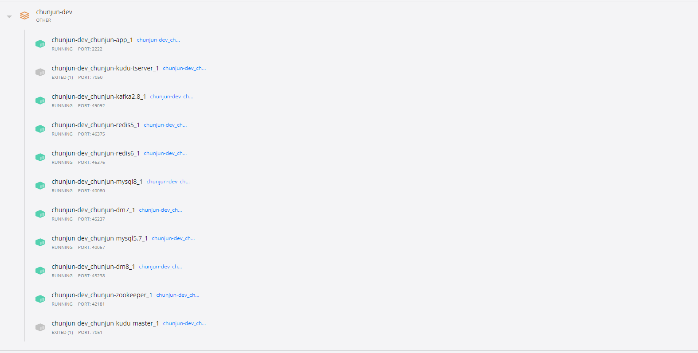
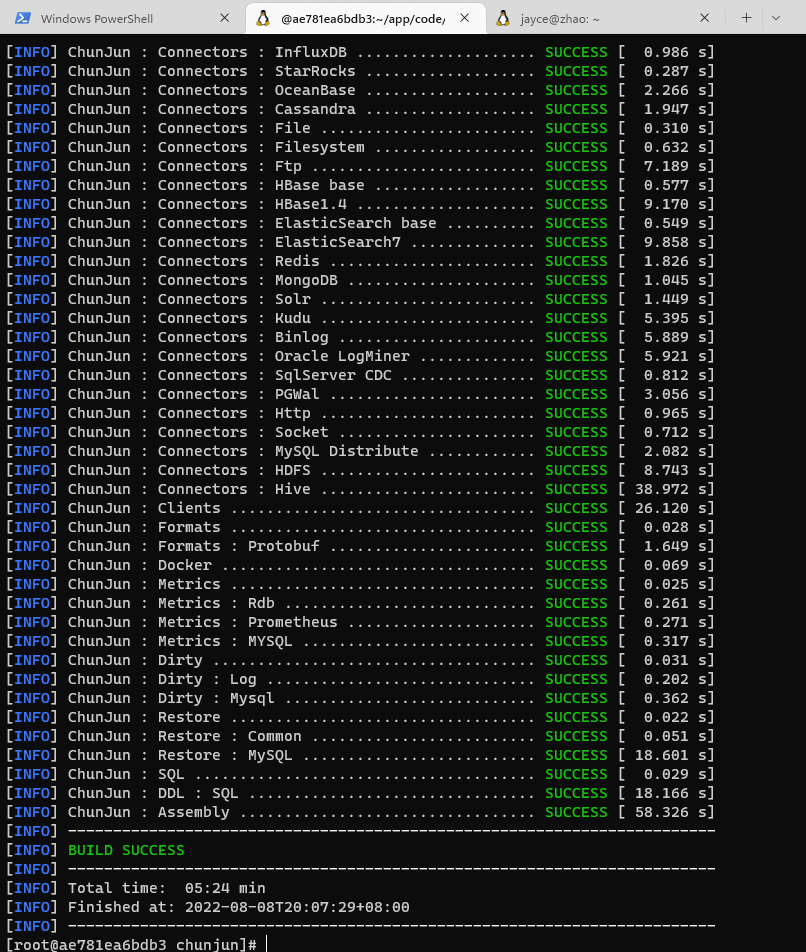
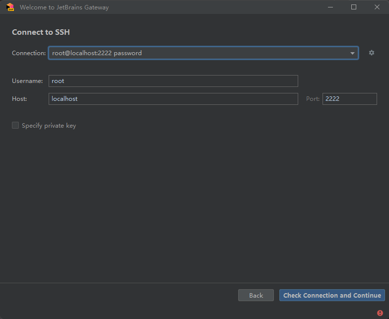
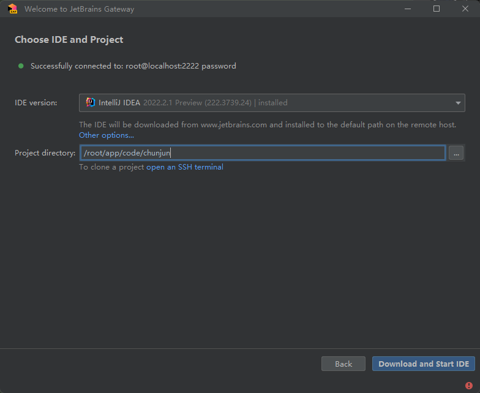
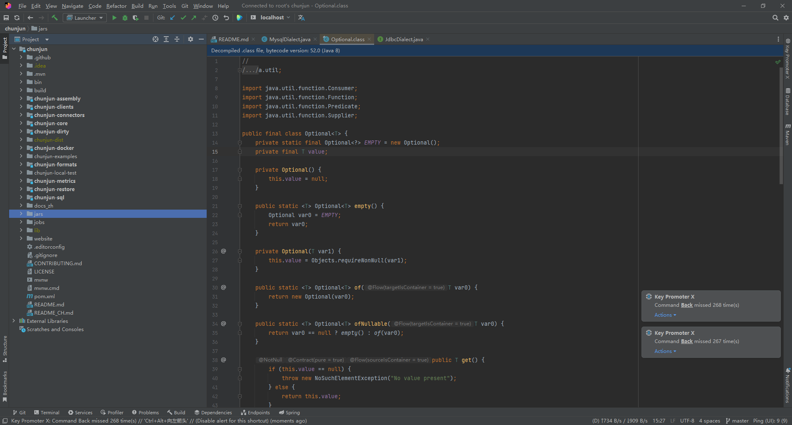
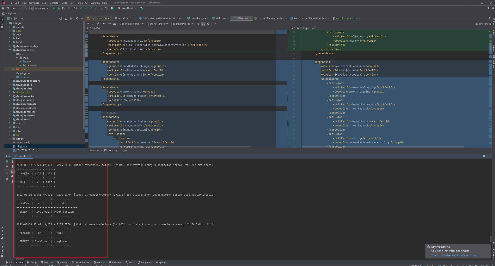

# Chunjun开发环境构建
一个基于 `docker` 的 `chunjun` 本地开发运行环境，也可以用于快速搭建chunjun的local开发环境。


## 使用
### 1. 按需修改 .env 配置 (主要包含了一些端口，如果被占用，请自行更改)
~~~
# 设置时区
TZ=Asia/Shanghai
# 设置网络模式
NETWORKS_DRIVER=bridge
# 宿主机上代码存放的目录路径
DATA_PATH_HOST=./data

# MYSQL57服务映射宿主机端口号，可在宿主机127.0.0.1:40057访问
MYSQL57_PORT=40057
MYSQL57_USERNAME=admin
MYSQL57_PASSWORD=123456
MYSQL57_ROOT_PASSWORD=123456

# MYSQL8服务映射宿主机端口号，可在宿主机127.0.0.1:40080访问
MYSQL8_PORT=40080
MYSQL8_USERNAME=admin
MYSQL8_PASSWORD=123456
MYSQL8_ROOT_PASSWORD=123456

# Redis5 服务映射宿主机端口号，可在宿主机127.0.0.1:46375访问
REDIS5_PORT=46375
REDIS5_PASSWORD=123456
# Redis6 服务映射宿主机端口号，可在宿主机127.0.0.1:46376访问
REDIS6_PORT=46376
REDIS6_PASSWORD=123456

# Dm7 服务映射宿主机端口号，可在宿主机127.0.0.1:45237访问
DM7_PORT=45237
# Dm8 服务映射宿主机端口号，可在宿主机127.0.0.1:45238访问
DM8_PORT=45238

# Zookeeper 服务映射宿主机端口号，可在宿主机127.0.0.1:42181访问
ZOOKEEPER_PORT=42181

# kafka28 服务映射宿主机端口号，可在宿主机127.0.0.1:49092访问
KAFKA28_PORT=49092

# kudu 服务映射宿主机端口号，可在宿主机127.0.0.1:49092访问
KUDU_MASTER_PORT=7051
KUDU_TSERVER_PORT=7050
~~~

### 2.启动服务
- 启动全部服务
```bash
docker-compose up -d
```
- 按需启动部分服务
```bash
# 其他的服务名，请查看docker-compose.yml
docker-compose up -d chunjun-redis5 chunjun-mysql8
```

### 3.停止服务
- 停止全部服务
```bash
docker-compose stop
```
- 按需停止部分服务
```bash
# 其他的服务名，请查看docker-compose.yml
docker-compose stop chunjun-redis5 chunjun-mysql8
```

### 4.开发示例
开发方式一般有两种，一种是使用IDEA(或者Jetbrain的gateway)和vscode进行开发，核心思路是远程到我们的app镜像当中开发。 为什么要远程到app镜像当中开发，主要是为了解决一些host映射的问题，我们在容器中debug代码，就不需要把host映射到主机，从而解决hbase，hive的一些host映射问题。
#### 4.1 启动开发环境
```shell
cd chunjun-dev
# 等待所有的镜像构建完毕
docker-compose up -d
# 构建部分镜像，(推荐)
docker-compose up chunjun-app
```


#### 4.2 进入app container，克隆代码
```shell
docker exec -it chunjun-dev_chunjun-app_1 bash

cd /root/app/code

git clone https://github.com/DTStack/chunjun.git

cd chunjun

mvn clean package -DskipTests
```


#### 4.3 IDE打开，这边使用的是Gateway
```shell
账号密码 root/root，等待进入IDE
```




#### 4.4 第一个测试
```shell
// 在chunjun的代码仓库下创建一个job是目录，创建文件mysql_to_print.json，复制下面的json
运行类 com.dtstack.chunjun.client.Launcher
运行参数 -job /root/app/code/chunjun/jobs/mysql_to_print.json -jobType sync -chunjunDistDir /root/app/code/chunjun/chunjun-dist
```
```json
{
  "job": {
    "content": [
      {
        "reader": {
          "name": "mysqlreader",
          "parameter": {
            "column": [
              {
                "name": "Host",
                "type": "string"
              },
              {
                "name": "User",
                "type": "string"
              }
            ],
            "username": "root",
            "password": "123456",
            "connection": [
              {
                "jdbcUrl": [
                  "jdbc:mysql://chunjun-mysql5.7:3306/mysql?useSSL=false"
                ],
                "table": [
                  "user"
                ]
              }
            ]
          }
        },
        "writer": {
          "name": "streamwriter",
          "parameter": {
            "print": true
          }
        }
      }
    ],
    "setting": {
      "speed": {
        "channel": 1,
        "bytes": 0
      }
    }
  }
}
```

```shell
//运行截图
1.如果你能得到相同的结果，那么开发环境就构建成功了.
2.请注意保护chunjun-dev/data/app目录下的文件,你改动的代码都会被同步到这个文件夹
```
### 5.kafka操作(ps：kafka已开启自动创建topic的功能)
```bash
docker exec -it chunjun-dev_chunjun-kafka2.8_1 /bin/sh
cd /opt/kafka/bin/

//创建topic
./kafka-topics.sh --create --zookeeper chunjun-zookeeper:2181 --replication-factor 1 -partitions 1 --topic chunjun-test

//查看所有topic
./kafka-topics.sh --list --zookeeper chunjun-zookeeper:2181

//测试producer，启动后输入hello,world
./kafka-console-producer.sh --bootstrap-server chunjun-kafka2.8:49092 --topic chunjun-test

//测试consumer,看到hello-world，表示安装完毕
./kafka-console-consumer.sh --bootstrap-server chunjun-kafka2.8:49092 --topic chunjun-test --from-beginning

```
