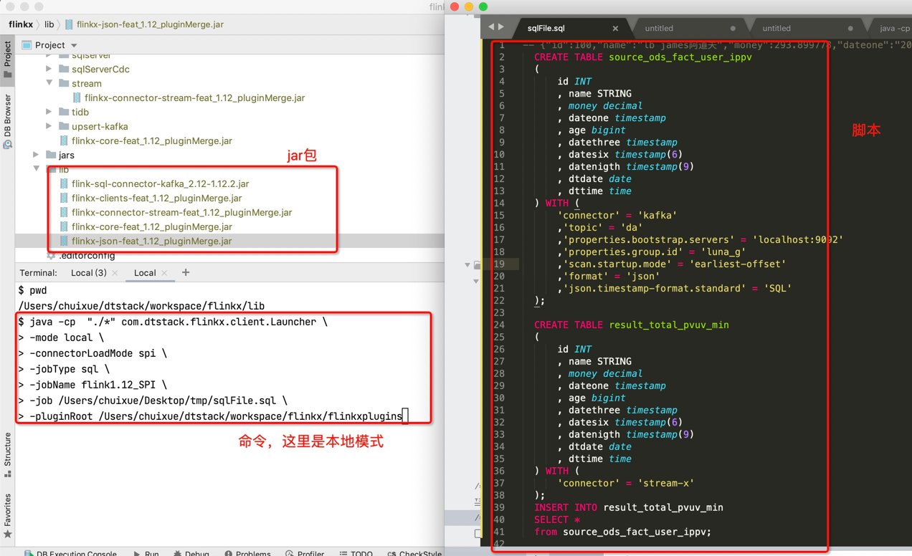
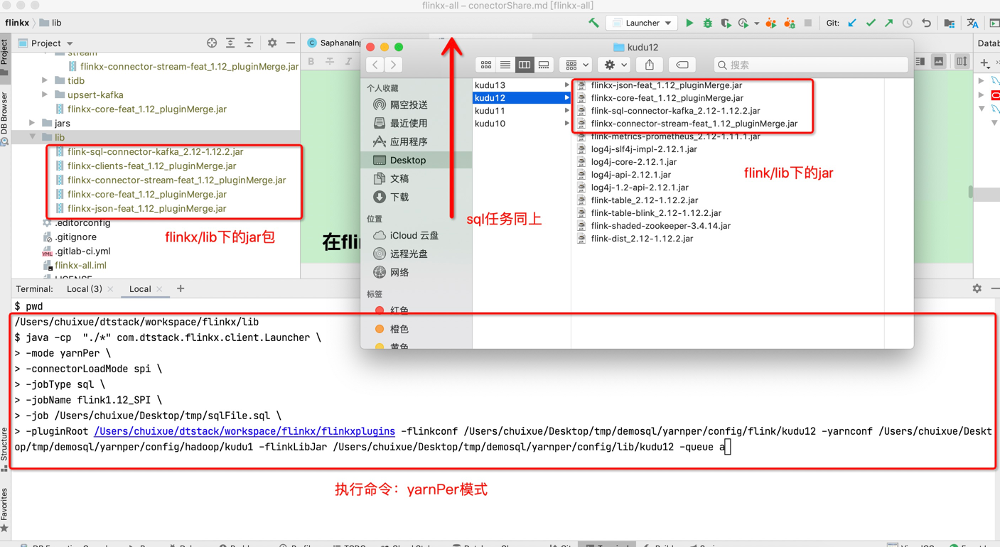
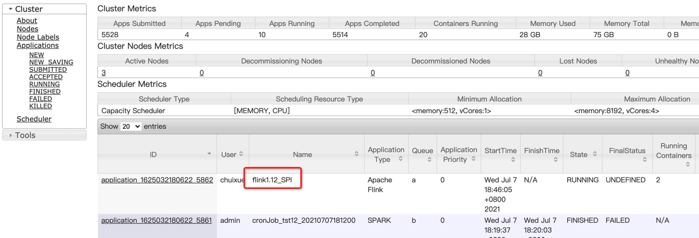

# connector 共用

**NOTE:新版flinkX支持connector和flinkSql自带的connector共用。**

## 在flinkX中使用flinkSql的connector

- **本地调试**
    - 在`flinkx-local-test`模块下将对应的flink connector的GAV拷贝到pom.xml文件中
    - 将flinkX中的connector的GAV拷贝到pom.xml文件中(部分flink connector已经通过flinkx connector引入,如果是则上一步省略)
    - 在LocalTest类中指定参数运行即可 sql:
      ```sql
        -- {"id":100,"name":"lb james阿道夫","money":293.899778,"dateone":"2020-07-30 10:08:22","age":"33","datethree":"2020-07-30 10:08:22.123","datesix":"2020-07-30 10:08:22.123456","datenigth":"2020-07-30 10:08:22.123456789","dtdate":"2020-07-30","dttime":"10:08:22"}
        CREATE TABLE source_ods_fact_user_ippv 
        (
            id INT
            , name STRING
            , money decimal
            , dateone timestamp
            , age bigint
            , datethree timestamp
            , datesix timestamp(6)
            , datenigth timestamp(9)
            , dtdate date
            , dttime time
        ) WITH (
            'connector' = 'kafka'
            ,'topic' = 'da'
            ,'properties.bootstrap.servers' = 'localhost:9092'
            ,'properties.group.id' = 'luna_g'
            ,'scan.startup.mode' = 'earliest-offset'
            ,'format' = 'json'
            ,'json.timestamp-format.standard' = 'SQL'
        );
        
        CREATE TABLE result_total_pvuv_min
        (
            id INT
            , name STRING
            , money decimal
            , dateone timestamp
            , age bigint
            , datethree timestamp
            , datesix timestamp(6)
            , datenigth timestamp(9)
            , dtdate date
            , dttime time
        ) WITH (
            'connector' = 'stream-x'
        );
        INSERT INTO result_total_pvuv_min
        SELECT *
        from source_ods_fact_user_ippv;
      ```
      pom:
      ```text
      <dependency>
          <groupId>org.apache.flink</groupId>
          <artifactId>flink-connector-kafka_2.12</artifactId>
          <version>1.12.2</version>
          <exclusions>
              <exclusion>
              <artifactId>flink-core</artifactId>
              <groupId>org.apache.flink</groupId>
              </exclusion>
          </exclusions>
      </dependency>
      <dependency>
          <groupId>com.dtstack.flinkx</groupId>
          <artifactId>flinkx-connector-stream</artifactId>
          <version>1.12-SNAPSHOT</version>
      </dependency>
      ```

<br />  

- **服务器上运行:**
    - 1.将需要的connector的jar包，和其他(包括flinkx-core-feat_1.12_pluginMerge.jar，如果kafka中用到了json也需要将json的format jar包)拷贝到flinkx/lib目录下,构建jobGraph使用
    - 2.将需要的connector的jar包，和其他(包括flinkx-core-feat_1.12_pluginMerge.jar，如果kafka中用到了json也需要将json的format jar包)拷贝到flink/lib下
    - 3.在在flinkx/lib下目录下执行命令：
        - local模式
      ```shell
      java -cp  "./*" com.dtstack.flinkx.client.Launcher \
      -mode local \
      -jobType sql \
      -jobName flink1.12_SPI \
      -job /yourjobpath/sqlFile.sql \
      -flinkxDistDir /flinkx/flinkx-dist
      ```
      

        - yarnPer模式
      ```shell
      java -cp  "./*" com.dtstack.flinkx.client.Launcher \
      -mode yarnPer \
      -jobType sql \
      -jobName flink1.12_SPI \
      -job /yourjobpath/sqlFile.sql \
      -flinkxDistDir /flinkx/flinkx-dist \
      -flinkConfDir /flink/conf \
      -hadoopConfDir /hadoop/etc \
      -flinkLibDir /flink/lib \
      -queue default
      ```
      
      

## 在flinkSql中使用flinkX的connector

- **本地调试**
    - 在自己项目中将对应的flink connector的GAV拷贝到pom.xml文件中
    - 将flinkX中的core和connector的GAV拷贝到pom.xml文件中(需要先deploy项目)
    - 运行自己的任务 sql:
    ```sql
        -- {"id":100,"name":"lb james阿道夫","money":293.899778,"dateone":"2020-07-30 10:08:22","age":"33","datethree":"2020-07-30 10:08:22.123","datesix":"2020-07-30 10:08:22.123456","datenigth":"2020-07-30 10:08:22.123456789","dtdate":"2020-07-30","dttime":"10:08:22"}
        CREATE TABLE source_ods_fact_user_ippv 
        (
            id INT
            , name STRING
            , money decimal
            , dateone timestamp
            , age bigint
            , datethree timestamp
            , datesix timestamp(6)
            , datenigth timestamp(9)
            , dtdate date
            , dttime time
        ) WITH (
            'connector' = 'kafka'
            ,'topic' = 'da'
            ,'properties.bootstrap.servers' = 'localhost:9092'
            ,'properties.group.id' = 'luna_g'
            ,'scan.startup.mode' = 'earliest-offset'
            ,'format' = 'json'
            ,'json.timestamp-format.standard' = 'SQL'
        );
        
        CREATE TABLE result_total_pvuv_min
        (
            id INT
            , name STRING
            , money decimal
            , dateone timestamp
            , age bigint
            , datethree timestamp
            , datesix timestamp(6)
            , datenigth timestamp(9)
            , dtdate date
            , dttime time
        ) WITH (
            'connector' = 'stream-x'
        );
        INSERT INTO result_total_pvuv_min
        SELECT *
        from source_ods_fact_user_ippv;
    ```
  pom:
    ```text
        <dependency>
            <groupId>org.apache.flink</groupId>
            <artifactId>flink-sql-connector-kafka_2.12</artifactId>
            <version>1.12.2</version>
        </dependency>
        <dependency>
            <groupId>com.dtstack.flinkx</groupId>
            <artifactId>flinkx-core</artifactId>
            <version>1.12-SNAPSHOT</version>
        </dependency>
        <dependency>
            <groupId>com.dtstack.flinkx</groupId>
            <artifactId>flinkx-connector-stream</artifactId>
            <version>1.12-SNAPSHOT</version>
        </dependency>
    ```

<br />

- **服务器上运行:**
    - 将flink需要的connector和flinkX的flinkx-core-feat_1.12_pluginMerge.jar包和对应connector的jar引入到自己项目的pom中，将项目打成fat包，提交任务即可。
