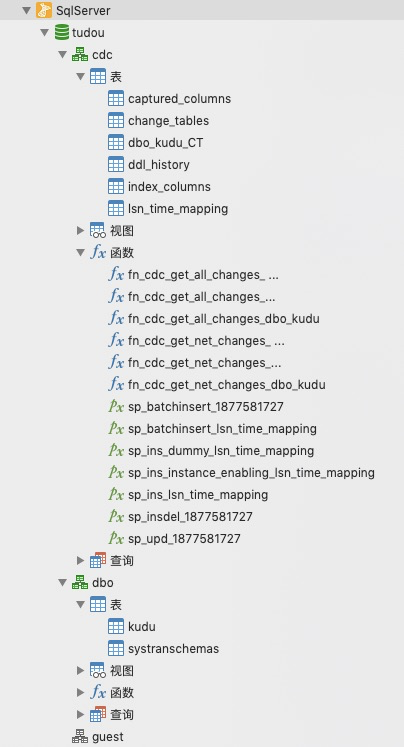
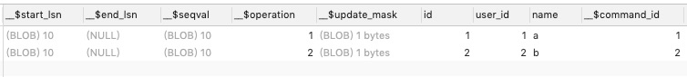
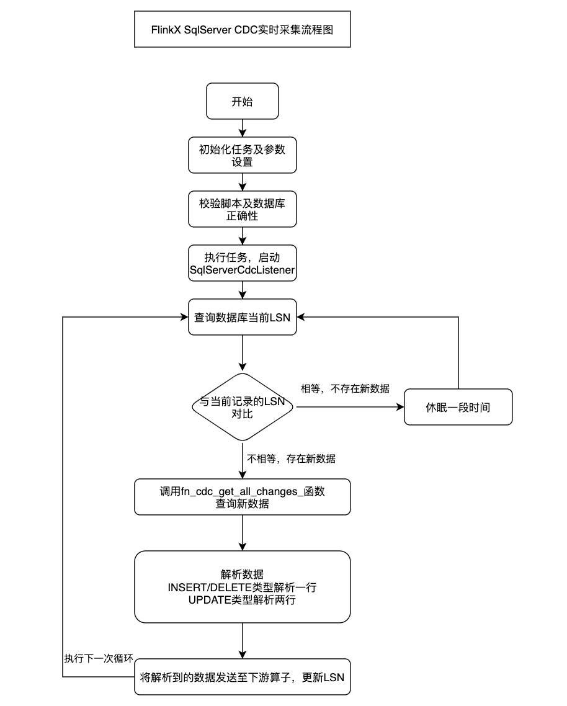

# SqlServer CDC Real-Time Collection Principles

<!-- TOC -->

- [SqlServer CDC Real-Time Collection Principle](#sqlserver-cdc Real-Time Collection Principle)
- [I. Fundamentals](# a foundation)
- [II. Configuration](# II configuration)
- [III. Principle](# III principle)
    - [1. SQL Server Agent](#1sql-server-agent)
    - [2. Database CDC before and after opening](#2 database cdc before and after opening)
    - [3. business table CDC before and after opening](#3business table CDC before and after opening)
    - [4. collection principle](#4 collection principle)
    - [1. insert/delete](#1insertdelete)
    - [2. update](#2update)
    - [3. Flowchart](#3flowchart)
    - [4. data format](#4data format)

<!-- /TOC -->

# I. Basics

SqlServer official support for CDC from SqlServer 2008 version, the document link is as follows.
[https://docs.microsoft.com/zh-cn/sql/relational-databases/track-changes/about-change-data-capture-sql-server?view=sql-server-ver15](https://docs.microsoft.com/zh-cn/sql/relational-databases/track-changes/about-change-data-capture-sql-server?view=sql-server-ver15)

# II. Configuration

The configuration document link is as follows.
[SqlServerConfigurationCDC](./other/SqlserverCDC configuration.md)

# Three, the principle

### 1. SQL Server Agent

SQL Server Agent agent service, a standard service of sql server, serves as an agent to perform all sql automation tasks, as well as unattended tasks such as database transactional replication. This service is stopped in the default installation, you need to start it manually or change it to automatic movement, otherwise the automation tasks of sql will not be executed, also pay attention to the service startup account. Simply put, this service is started before the capture process will process the transaction log and write entries to the CDC table.
[https://docs.microsoft.com/zh-cn/sql/ssms/agent/sql-server-agent?view=sql-server-ver15](https://docs.microsoft.com/zh-cn/sql/ssms/agent/sql-server-agent?view=sql-server-ver15)

### 2. Comparison of database CDC before and after turning it on

Before turning on.

<div align=center>

</div>
<br/>
After opening.
EXEC sys.sp_cdc_enable_db;

<div align=center>

</div>
<br/>

We first observe that a new **systranschemas** table has been added under dbo. The **systranschemas** table is used to track architectural changes in projects published in transaction releases and snapshot releases.

| Column Name | Data Type | Description                                                 |
| ------------- | ----------- | ------------------------------------------------------------- |
| tabid       | int       | Identifies the table item where the schema change occurred. |
| startlsn    | binary    | The LSN value at the start of the schema change.            |
| endlsn      | binary    | The LSN value at the end of the schema change.              |
| typeid      | int       | The type of architecture change.                            |

A new schema named cdc has been added under the database, and in fact a new cdc user has been added. cdc has the following four new tables.
<br/>
**1. captured_columns**
Returns a row for each column tracked in the captured instance. By default, all columns in the source table will be captured. However, if the source table is enabled for change data capture, columns can be included in or excluded from the capture by specifying a list of columns. When there is no business table with CDC enabled, the table is empty.

| Column Name    | Data Type | Description                                                                                                                                                                                |
| ---------------- | ----------- | -------------------------------------------------------------------------------------------------------------------------------------------------------------------------------------------- |
| object_id      | int       | The ID of the change table to which the captured column belongs.                                                                                                                           |
| column_name    | sysname   | The name of the captured column.                                                                                                                                                           |
| column_id      | int       | The ID of the captured column in the source table.                                                                                                                                         |
| column_type    | sysname   | The type of the captured column.                                                                                                                                                           |
| column_ordinal | int       | Change the column ordinal number in the table (starting from 1). The metadata columns in the change table will be excluded. Serial number 1 will be assigned to the first column captured. |
| is_computed    | bit       | Indicates that the captured column is a computed column from the source table.                                                                                                             |

**2. change_tables**
Returns one row for each changed table in the database. When change data capture is enabled for a source table, a change table is created. When no business table has CDC enabled, the table is empty.

| Column Name          | Data Type  | Description                                                                                                                                                                                                                                                                                                                                                                                                                                                                                                                                                                                                                                                                                                                                                                                                                                                                                                                                  |
| ---------------------- | ------------ | ---------------------------------------------------------------------------------------------------------------------------------------------------------------------------------------------------------------------------------------------------------------------------------------------------------------------------------------------------------------------------------------------------------------------------------------------------------------------------------------------------------------------------------------------------------------------------------------------------------------------------------------------------------------------------------------------------------------------------------------------------------------------------------------------------------------------------------------------------------------------------------------------------------------------------------------------- |
| object_id            | int        | The ID of the change table. Unique in the database.                                                                                                                                                                                                                                                                                                                                                                                                                                                                                                                                                                                                                                                                                                                                                                                                                                                                                          |
| version              | int        | Identified for reference only. Not supported. Future compatibility is not guaranteed. For SQL Server 2012 (11.x), this column always returns 0.                                                                                                                                                                                                                                                                                                                                                                                                                                                                                                                                                                                                                                                                                                                                                                                              |
| source_object_id     | int        | The ID of the source table enabled for change data capture.                                                                                                                                                                                                                                                                                                                                                                                                                                                                                                                                                                                                                                                                                                                                                                                                                                                                                  |
| capture_instance     | sysname    | The name of the capture instance used to name the instance-specific trace object. By default, the name is derived from the source schema name plus the source table name in the format schemaname_sourcename.                                                                                                                                                                                                                                                                                                                                                                                                                                                                                                                                                                                                                                                                                                                                |
| start_lsn            | binary(10) | Log sequence number (LSN), indicating the low endpoint when querying the change data in the change table. null = low endpoint not yet established.                                                                                                                                                                                                                                                                                                                                                                                                                                                                                                                                                                                                                                                                                                                                                                                           |
| end_lsn              | binary(10) | Identified for reference only. Not supported. Future compatibility is not guaranteed. For SQL Server 2008, this column always returns NULL.                                                                                                                                                                                                                                                                                                                                                                                                                                                                                                                                                                                                                                                                                                                                                                                                  |
| supports_net_changes | bit        | Enables query net change support for change tables.                                                                                                                                                                                                                                                                                                                                                                                                                                                                                                                                                                                                                                                                                                                                                                                                                                                                                          |
| has_drop_pending     | bit        | The capture process received a notification that the source table has been deleted.                                                                                                                                                                                                                                                                                                                                                                                                                                                                                                                                                                                                                                                                                                                                                                                                                                                          |
| role_name            | sysname    | The name of the database role used to access the changed data. nULL = role not used.                                                                                                                                                                                                                                                                                                                                                                                                                                                                                                                                                                                                                                                                                                                                                                                                                                                         |
| index_name           | sysname    | The name of the index used to uniquely identify the rows in the source table. index_name is the name of the primary key index of the source table, or the name of the unique index specified when change data capture was enabled for the source table. NULL = The source table had no primary key and no unique index was specified when change data capture was enabled. Note: If change data capture is enabled for a table with a primary key, the Change Data Capture feature will use the index regardless of whether net changes are enabled. When change data capture is enabled, changes to the primary key will not be allowed. If the table does not have a primary key, change data capture can still be enabled, but only net changes can be set to False. Once change data capture is enabled, primary keys can be created. Since the change data capture feature does not use primary keys, you can also modify primary keys. |
| filegroup_name       | sysname    | Changes the name of the filegroup in which the table resides. NULL = Changes the default filegroup in which the table resides in the database.                                                                                                                                                                                                                                                                                                                                                                                                                                                                                                                                                                                                                                                                                                                                                                                               |
| create_date          | datetime   | The date on which the source table was enabled.                                                                                                                                                                                                                                                                                                                                                                                                                                                                                                                                                                                                                                                                                                                                                                                                                                                                                              |
| partition_switch     | bit        | Indicates whether the SWITCH PARTITION command of ALTER TABLE can be executed on a table with change data capture enabled. 0 indicates that partition switching is blocked. Unpartitioned tables always return 1.                                                                                                                                                                                                                                                                                                                                                                                                                                                                                                                                                                                                                                                                                                                            |

**3. ddl_history**
Returns one row for each Data Definition Language (DDL) change made to a table with change data capture enabled. You can use this table to determine when DDL changes occurred to the source table and what was changed. This table does not contain any entries for the source table where no DDL changes occurred. This table is empty when there are no changes to the table structure of any business table with CDC turned on.

| Column Name            | Data Type     | Description                                                                                                                                     |
| ------------------------ | --------------- | ------------------------------------------------------------------------------------------------------------------------------------------------- |
| source_object_id       | int           | The ID of the source table to which the DDL change was applied.                                                                                 |
| object_id              | int           | The ID of the changed table associated with the capture instance of the source table.                                                           |
| required_column_update | bit           | Indicates that the data type of the capture column was modified in the source table. This modification changes the columns in the change table. |
| ddl_command            | nvarchar(max) | The DDL statement to be applied to the source table.                                                                                            |
| ddl_lsn                | binary(10)    | The log sequence number (LSN) associated with the commit of the DDL modification.                                                               |
| ddl_time               | datetime      | The date and time of the DDL changes made to the source table.                                                                                  |

**4. index_columns**
Returns one row for each index column associated with the changed table. Change data capture uses these index columns to uniquely identify the rows in the source table. By default, the primary key columns of the source table will be included. However, if the source table's unique index is specified when change data capture is enabled for the source table, the columns in that index will be used instead. If net change tracking is enabled, the primary key or unique index is required for that source table. When no index column exists for any business table with CDC enabled, the table is empty.

| Column Name   | Data Type | Description                                              |
| --------------- | ----------- | ---------------------------------------------------------- |
| object_id     | int       | Change the ID of the table.                              |
| column_name   | sysname   | The name of the index column.                            |
| index_ordinal | tinyint   | The number of the column in the index (starting from 1). |
| column_id     | int       | The ID of the column in the source table.                |

**5. lsn_time_mapping**
Returns a row for each transaction that has a row in the change table. This table is used to create a mapping between the log sequence number (LSN) commit value and the time of the committed transaction. Items that do not have corresponding change table entries can also be logged so that the table records the completion of LSN processing during periods of little or no change activity.

| Column Name     | Data Type      | Description                                                    |
| ----------------- | ---------------- | ---------------------------------------------------------------- |
| start_lsn       | binary(10)     | The LSN of the committed transaction.                          |
| tran_begin_time | datetime       | The time when the transaction associated with the LSN started. |
| tran_end_time   | datetime       | The time when the transaction ended.                           |
| tran_id         | varbinary (10) | The ID of the transaction.                                     |

The following functions have been added under cdc.
<br/>

**1. fn_cdc_get_all_changes_**
Returns one row for each change applied to the source table within the specified log sequence number (LSN) range. If the source row has multiple changes within that interval, each change is represented in the returned result set. In addition to returning change data, the four metadata columns provide the information needed to apply changes to another data source. The row filter option controls the content of the metadata columns and the rows returned in the result set. When the "all" row filter option is specified, there will be only one row for each change to identify that change. When the "all update old" option is specified, the update operation is represented as two rows: one containing the values of the captured columns before the update and the other containing the values of the captured columns after the update. This enumerated function is created when change data capture is enabled for the source table. The function name is derived and uses the **cdc.fn_cdc_get_all_changes_**_
capture_instance_ format, where _capture_instance_ is the value specified for the capture instance when change data capture is enabled for the source table.

| column_name                      | data_type      | description                                                                                                                                                                                                                                                                                                                                                                                                                                                                         |
| ---------------------------------- | ---------------- | ------------------------------------------------------------------------------------------------------------------------------------------------------------------------------------------------------------------------------------------------------------------------------------------------------------------------------------------------------------------------------------------------------------------------------------------------------------------------------------- |
| __$start_lsn                     | binary(10)     | The commit LSN associated with the change, used to preserve the commit order of the change. Changes committed in the same transaction will share the same commit LSN value.                                                                                                                                                                                                                                                                                                         |
| __$seqval                        | binary(10)     | Sequence of values used to sort the row changes within a transaction.                                                                                                                                                                                                                                                                                                                                                                                                               |
| __$operation                     | int            | Identifies the Data Manipulation Language (DML) operation required to apply the changed data row to the target data source. Can be one of the following values.<br/>1 = Delete<br/>2 = Insert<br/>3 = Update (the captured column value is the value before the update operation is performed). This value is applied only if the row filter option "all update old" is specified.<br/>4 = update (the captured column value is the value after the update operation is performed). |
| __$update_mask                   | varbinary(128) | A bit mask that corresponds to one bit for each captured column that identifies the capture instance. When\__\$operation = 1 or 2, this value sets all defined bits to 1. When __$ operation = 3 or 4, only the bit corresponding to the changed column is set to 1.                                                                                                                                                                                                                |
| \<captured source table columns> | various        | The remaining columns returned by the function are the captured columns identified at the time the capture instance was created. If no columns are specified in the list of captured columns, all columns in the source table are returned.                                                                                                                                                                                                                                         |

**2. fn_cdc_get_net_changes_**
Returns a net changes row for each source row within the specified log sequence number in the (LSN) range, in the same format as above.

### 3. Comparison of before and after business table CDC is turned on

Before opening is the same as the previous chart

Open SQL.

```sql
sys.sp_cdc_enable_table 
-- the name of the schema to which the table belongs
[ @source_schema = ] 'source_schema', 

-- the name of the table
[ @source_name = ] 'source_name' ,

-- is the name of the database role used to control access to the changed data
[ @role_name = ] 'role_name'

-- is the name of the capture instance used to name the change data capture object, a name that will need to be used frequently in later stored procedures and functions.
[,[ @capture_instance = ] 'capture_instance' ]

-- Indicates whether net change query support is enabled for this capture instance if this table has a primary key or a unique index that has been identified using the @index_name parameter. otherwise, this parameter defaults to 0.
[,[ @supports_net_changes = ] supports_net_changes ]

-- The name of the unique index used to uniquely identify the rows in the source table. index_name is sysname and can be NULL.
-- If specified, index_name must be the only valid index of the source table. If index_name is specified, the index column identified takes precedence over any defined primary key column, just like the table's unique row identifier.
[,[ @index_name = ] 'index_name' ]

-- Which columns need to be captured. captured_column_list has the data type nvarchar(max) and can be NULL. if NULL, all columns will be included in the change table.
[,[ @captured_column_list = ] 'captured_column_list' ]

-- is the filegroup to be used for the changes table created for the capture instance.
[,[ @filegroup_name = ] 'filegroup_name' ]

-- Indicates whether the SWITCH PARTITION command of ALTER TABLE can be executed on tables with change data capture enabled.
-- allow_partition_switch is bit, default value is 1.
[,[ @partition_switch = ] 'partition_switch' ]
```

When turned on.

<div align=center>

</div>
<br/>
At this point, a new table named dbo_kudu_CT is added under cdc, and for any business table with CDC turned on, a table of format \${schema}\_${table}\_CT will be created under its corresponding cdc schema.

**1. dbo_kudu_CT:**
The change table created when change data capture is enabled for the source table. This table returns one row for each insert and delete operation performed on the source table and two rows for each update operation performed on the source table. If the name of the change table is not specified when the source table is enabled, a derived name is used. The format of the name is cdc. capture_instance _CT where capture_instance is the name of the source table's schema and the name of the source table in the format schema_table. For example, if change data capture is enabled for the table Person in the AdventureWorks sample database, the derived change table name will be cdc.Person_Address_CT.

| Column Name                      | Data Type       | Description                                                                                                                                                                                                                                                                                                                                                              |
| ---------------------------------- | ----------------- | -------------------------------------------------------------------------------------------------------------------------------------------------------------------------------------------------------------------------------------------------------------------------------------------------------------------------------------------------------------------------- |
| __$start_lsn                     | binary(10)      | The log sequence number (LSN) associated with the commit transaction for the corresponding change. All changes committed in the same transaction will share the same commit LSN. For example, if a delete operation on a source table deletes two rows, the changes table will contain two rows, each with the same __ $ start_lsn value.                                |
| __ $ end_lsn                     | binary(10)      | Marked as for information only. Not supported. Future compatibility is not guaranteed. In SQL Server 2012 (11.x), this column is always NULL.                                                                                                                                                                                                                            |
| __$seqval                        | binary(10)      | Sequential value used to sort row changes within a transaction.                                                                                                                                                                                                                                                                                                          |
| __$operation                     | int             | Identifies the Data Manipulation Language (DML) operation associated with the corresponding change. Can be one of the following values.<br/>1 = Delete<br/>2 = Insert<br/>3 = Update (old value) column data with the row value before the update statement was executed.<br/>4 = Update (new value) column data with row values after the update statement is executed. |
| __$update_mask                   | varbinary(128)  | Bitmask based on the column serial number of the change table, used to identify those columns that have changed.                                                                                                                                                                                                                                                         |
| \<captured source table columns> | Many and varied | The remaining columns in the change table are those that were identified as captured columns in the source table when the capture instance was created. If no columns are specified in the list of captured columns, all columns in the source table will be included in this table.                                                                                     |
| __ $ command_id                  | int             | Tracks the order of operations in a transaction.                                                                                                                                                                                                                                                                                                                         |

**2. captured_columns:**

<div align=center>

</div>
<br/>

**3. change_tables:**

<div align=center>

</div>

<br/>

### 4. Acquisition principle!

#### 1. insert/delete

For insert and delete type of data changes, for each row change will add a row in the corresponding \${schema}\_${table}\_CT table. For insert, id, user_id, and name are the value values after insert; for delete, id, user_id, and name are the value values before delete.

<div align=center>

</div>

<br/>

#### 2. update

a. Primary key updated At this time, the SqlServer database practice is within the same thing, the original record is deleted first, and then re-inserted. Execute the following SQL, log table as shown in the figure. UPDATE [dbo]. [kudu] SET [id] = 2, [user_id] = '2', [name] = 'b' WHERE [id] = 1;

<div align=center>

</div>
<br/>
b. Primary key not updated
At this point, what the SqlServer database does is to update the field information directly.
Execute the following SQL with the log table as shown in the figure.
UPDATE [dbo]. [kudu] SET [user_id] = '3', [name] = 'c' WHERE [id] = 2;

<div align=center>

</div>
<br/>

#### 3. Flowchart

<div align=center>

</div>
<br/>
For FlinkX SqlServer CDC real-time collection plug-in, the basic principle is to call the fn_cdc_get_all_changes_ function in a polling manner, cyclically, to get the data between the last ending lsn and the current maximum lsn value of the database. For insert/delete types, it gets and parses one row, and for update types, it gets and parses two rows. After parsing, pass the data to the downstream and record the lsn of the current parsed data to prepare for the next polling.

#### 4. Data format

```json
{
    "type": "update",
    "schema": "dbo",
    "table": "tb1",
    "lsn": "00000032:0000002038:0005",
    "ts": 6760525407742726144,
    "before_id":1,
    "after_id":2
}
```
