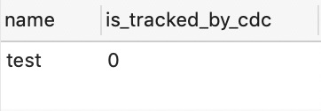

# SqlServer Configuring CDC

<!-- TOC -->

- [SqlServer configuration CDC](#sqlserver configuration cdc)
  - [1. query SqlServer database version](#1 query sqlserver database version)
  - [2. query the current user rights, must be a member of the sysadmin fixed server role to allow the database to enable the CDC (change data capture) function](#2 query the current user rights must be a member of the sysadmin fixed server role to allow the database to enable the cdc change data capture function)
  - [3. query whether the database has been enabled CDC (change data capture) function](#3 query whether the database has been enabled cdc change data capture function)
  - [4. Enable CDC(change data capture) function for database database](#4Enable CDC change data capture function for database database)
  - [5. query whether the table has enabled CDC (change data capture) function](#5 query whether the table has enabled cdc change data capture function)
  - [6. Enable CDC(change data capture) function for table](#6 enable CDC change data capture function for table)
  - [7. confirm whether CDC agent is started normally](#7 confirm whether cdc-agent-is started normally)

Note: SqlServer has supported CDC (Change Data Capture) since version 2008, this article is based on SqlServer 2017.

<!-- /TOC -->

#### 1. Query SqlServer database version

SQL: `SELECT @@VERSION`
Result.

<div align=center>
  
</div>

#### 2. Query the current user permissions, must be a member of sysadmin fixed server role to allow the CDC (Change Data Capture) feature to be enabled on the database

SQL: `exec sp_helpsrvrolemember 'sysadmin'`
Result.

<div align=center>

</div>

#### 3. Query whether the database has enabled CDC (Change Data Capture) function

SQL: `select is_cdc_enabled, name from sys.databases where name = 'tudou'`
Result.

<div align=center>

</div>
<br/>
0: not enabled; 1: enabled

#### 4. Enable CDC (Change Data Capture) for database databases

SQL.

```sql
USE tudou
    GO  
EXEC sys.sp_cdc_enable_db  
GO  
```

Repeat step 3 to make sure the database is enabled for CDC (Change Data Capture).

<div align=center>

</div>

#### 5. Query whether the table has enabled CDC (Change Data Capture) function

SQL: `select name,is_tracked_by_cdc from sys.tables where name = 'test';`
Result.

<div align=center>

</div
0: not enabled; 1: enabled

#### 6. Enable CDC (Change Data Capture) for tables    

SQL.

```sql
EXEC sys.sp_cdc_enable_table 
@source_schema = 'dbo', 
@source_name = 'test', 
@role_name = NULL, 
@supports_net_changes = 0;
```

source_schema: the name of the schema where the table is located
source_name: the name of the table
role_name: the name of the access control role, where null does not set access control
supports_net_changes: whether to generate a net change function for the capture instance, 0: no; 1: yes

Repeat step 5 to confirm that the table has CDC (Change Data Capture) enabled.

<div align=center>

</div>

At this point, the table `test` starts the CDC (Change Data Capture) function configuration is complete.

#### 7. Verify that the CDC agent is started properly

```sql
EXEC master.dbo.xp_servicecontrol N'QUERYSTATE', N'SQLSERVERAGENT'
```

<div align=center>

</div>
If the above status is displayed, you need to start the corresponding agent.

**Windows environment operation to enable CDC agent**
Click on the following location to enable the agent

<div align=center>

</div>

**Restart the database**

<div align=center>

</div>

**Check the agent status again to confirm the status change to running**

<div align=center>

</div>

At this point, the table `test` starts the CDC (change data capture) function configuration is complete.

**docker environment operation to turn on CDC agent**

**Enable agent service for mssql-server**_

```shell
docker exec -it sqlserver bash
/opt/mssql/bin/mssql-conf set sqlagent.enabled true
docker stop sqlserver
docker start sqlserver
```

Reference reading: [https://docs.microsoft.com/zh-cn/sql/relational-databases/track-changes/enable-and-disable-change-data-capture-sql-server?view=sql-server-2017](https://docs.microsoft.com/zh-cn/sql/relational-databases/track-changes/enable-and-disable-change-data-capture-sql-server?view=sql-server-2017)
