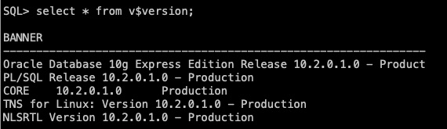
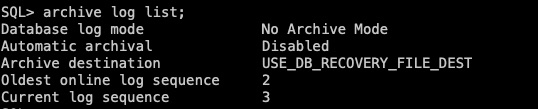
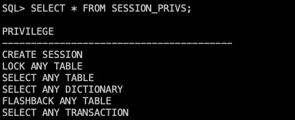
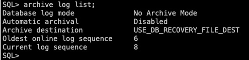
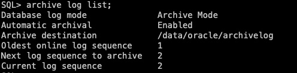

# Oracle配置LogMiner

目录:
<!-- TOC -->

- [Oracle配置LogMiner](#oracle配置logminer)
    - [一、Oracle 10g(单机版)](#一oracle-10g单机版)
        - [1、查询Oracle版本信息，这里配置的是`Oracle 10g`](#1查询oracle版本信息这里配置的是oracle-10g)
        - [2、通过命令行方式登录Oracle，查看是否开启日志归档](#2通过命令行方式登录oracle查看是否开启日志归档)
        - [3、开启日志归档，开启日志归档需要重启数据库，请注意](#3开启日志归档开启日志归档需要重启数据库请注意)
            - [a、配置归档日志保存的路径](#a配置归档日志保存的路径)
            - [b、关闭数据库](#b关闭数据库)
            - [c、开启日志归档](#c开启日志归档)
            - [d、开启扩充日志](#d开启扩充日志)
            - [e、开启数据库](#e开启数据库)
        - [4、配置日志组](#4配置日志组)
            - [a、查询默认日志组信息](#a查询默认日志组信息)
            - [b、查询日志组储存路径](#b查询日志组储存路径)
            - [c、新增日志组与删除原有日志组](#c新增日志组与删除原有日志组)
            - [d、查询创建的日志组](#d查询创建的日志组)
        - [5、检查是否安装LogMiner工具](#5检查是否安装logminer工具)
        - [6、创建LogMiner角色并赋权](#6创建logminer角色并赋权)
        - [7、创建LogMiner用户并赋权](#7创建logminer用户并赋权)
        - [8、验证用户权限](#8验证用户权限)
    - [二、Oracle 11g(单机版)](#二oracle-11g单机版)
        - [1、查询Oracle版本信息，这里配置的是`Oracle 11g`](#1查询oracle版本信息这里配置的是oracle-11g)
        - [2、通过命令行方式登录Oracle，查看是否开启日志归档](#2通过命令行方式登录oracle查看是否开启日志归档-1)
        - [3、开启日志归档，开启日志归档需要重启数据库，请注意](#3开启日志归档开启日志归档需要重启数据库请注意-1)
            - [a、配置归档日志保存的路径](#a配置归档日志保存的路径-1)
            - [b、关闭数据库](#b关闭数据库-1)
            - [c、开启日志归档](#c开启日志归档-1)
            - [d、开启扩充日志](#d开启扩充日志-1)
            - [e、开启数据库](#e开启数据库-1)
        - [4、检查是否安装LogMiner工具](#4检查是否安装logminer工具)
        - [5、创建LogMiner角色并赋权](#5创建logminer角色并赋权)
        - [6、创建LogMiner用户并赋权](#6创建logminer用户并赋权)
        - [7、验证用户权限](#7验证用户权限)
    - [三、Oracle 12c(单机版非CBD)](#三oracle-12c单机版非cbd)
        - [1、查询Oracle版本信息，这里配置的是`Oracle 12c`](#1查询oracle版本信息这里配置的是oracle-12c)
        - [2、通过命令行方式登录Oracle，查看是否开启日志归档](#2通过命令行方式登录oracle查看是否开启日志归档-2)
        - [3、开启日志归档，开启日志归档需要重启数据库，请注意](#3开启日志归档开启日志归档需要重启数据库请注意-2)
            - [a、配置归档日志保存的路径](#a配置归档日志保存的路径-2)
            - [b、关闭数据库](#b关闭数据库-2)
            - [c、开启日志归档](#c开启日志归档-2)
            - [d、开启扩充日志](#d开启扩充日志-2)
            - [e、开启数据库](#e开启数据库-2)
        - [4、创建LogMiner角色并赋权](#4创建logminer角色并赋权)
        - [5、创建LogMiner用户并赋权](#5创建logminer用户并赋权)
        - [6、验证用户权限](#6验证用户权限)

<!-- /TOC -->

注意：

1、某个Oracle数据源能同时运行的任务数量取决于该Oracle的内存大小

2、若数据量太大导致日志组频繁切换需要增加日志组数量，增大单个日志组存储大小

## 一、Oracle 10g(单机版)

### 1、查询Oracle版本信息，这里配置的是`Oracle 10g`

```sql
--查看oracle版本
select * from v$version;
```

<div align=center>
  
</div>
本章Oracle的版本如上图所示。

### 2、通过命令行方式登录Oracle，查看是否开启日志归档

```sql
--查询数据库归档模式
archive log list;
```

<div align=center>
  
</div>
图中显示`No Archive Mode`表示未开启日志归档。

### 3、开启日志归档，开启日志归档需要重启数据库，请注意

#### a、配置归档日志保存的路径

根据自身环境配置归档日志保存路径，需要提前创建相应目录及赋予相应访问权限

```shell
# 创建归档日志保存目录
mkdir -p /data/oracle/archivelog

# 进入Oracle目录
cd $ORACLE_HOME

# 查看Oracle权限组，本章权限组如下图所示
ls -l

# 对归档日志保存目录赋予相应权限
chown -R 下图中的用户名:下图中的组名 /data/oracle/
```

<div align=center>
  
</div>

```sql
--配置归档日志保存的路径
alter system set log_archive_dest_1='location=/data/oracle/archivelog' scope=spfile;
```

#### b、关闭数据库

```sql
shutdown immediate;
startup mount;
```

#### c、开启日志归档

```sql
--开启日志归档
alter database archivelog;
```

#### d、开启扩充日志

```sql
--开启扩充日志
alter database add supplemental log data (all) columns; 
```

#### e、开启数据库

```sql
alter database open;
```

再次查询数据库归档模式，`Archive Mode`表示已开启归档模式，`Archive destination`表示归档日志储存路径。
<div align=center>
  
</div>

### 4、配置日志组

#### a、查询默认日志组信息

```sql
SELECT * FROM v$log;
```

<div align=center>
  
</div>

如上图所示，日志组的默认数量为2组，大小为4194304/1024/1024 = 4MB，这意味着日志大小每达到4MB就会进行日志组的切换，切换太过频繁会导致查询出错，因此需要增加日志组数量及大小。

#### b、查询日志组储存路径

```sql
SELECT * FROM v$logfile;
```

<div align=center>
  
</div>

如上图所示，默认路径为`/usr/lib/oracle/xe/app/oracle/flash_recovery_area/XE/onlinelog/`。

#### c、新增日志组与删除原有日志组

请与DBA联系，决定是否可以删除原有日志组。

```sql
--增加两组日志组
alter database add logfile group 3 ('/usr/lib/oracle/xe/app/oracle/flash_recovery_area/XE/onlinelog/redo3.log') size 200m;
alter database add logfile group 4 ('/usr/lib/oracle/xe/app/oracle/flash_recovery_area/XE/onlinelog/redo4.log') size 200m;
```

```sql
--删除原有两组日志组，并继续新增两组日志组
alter system checkpoint;
alter system switch logfile;
alter database drop logfile group 1;
alter database drop logfile group 2;
alter database add logfile group 1 ('/usr/lib/oracle/xe/app/oracle/flash_recovery_area/XE/onlinelog/redo1.log') size 200m;
alter database add logfile group 2 ('/usr/lib/oracle/xe/app/oracle/flash_recovery_area/XE/onlinelog/redo2.log') size 200m;
```

#### d、查询创建的日志组

```sql
SELECT * FROM v$log;
SELECT * FROM v$logfile;
```

<div align=center>
  
</div>

<div align=center>
  
</div>

### 5、检查是否安装LogMiner工具

Oracle10g默认已安装LogMiner工具包，通过以下命令查询：

```sql
desc DBMS_LOGMNR;
desc DBMS_LOGMNR_D;
```

若无信息打印，则执行下列SQL初始化LogMiner工具包：

```sql
@$ORACLE_HOME/rdbms/admin/dbmslm.sql;
@$ORACLE_HOME/rdbms/admin/dbmslmd.sql;
```

### 6、创建LogMiner角色并赋权

其中`roma_logminer_privs`为角色名称，可根据自身需求修改。

```sql
create role roma_logminer_privs;
grant create session,execute_catalog_role,select any transaction,flashback any table,select any table,lock any table,select any dictionary to roma_logminer_privs;
grant select on SYSTEM.LOGMNR_COL$ to roma_logminer_privs;
grant select on SYSTEM.LOGMNR_OBJ$ to roma_logminer_privs;
grant select on SYSTEM.LOGMNR_USER$ to roma_logminer_privs;
grant select on SYSTEM.LOGMNR_UID$ to roma_logminer_privs;
grant select_catalog_role to roma_logminer_privs;
```

### 7、创建LogMiner用户并赋权

其中`roma_logminer`为用户名，`password`为密码，请根据自身需求修改。

```sql
create user roma_logminer identified by password default tablespace users;
grant roma_logminer_privs to roma_logminer;
grant execute_catalog_role to roma_logminer;
alter user roma_logminer quota unlimited on users;
```

### 8、验证用户权限

以创建的LogMiner用户登录Oracle数据库，执行以下SQL查询权限，结果如图所示：

```sql
 SELECT * FROM USER_ROLE_PRIVS;
```

<div align=center>
  
</div>

```sql
SELECT * FROM SESSION_PRIVS;
```

<div align=center>
  
</div>

至此，Oracle 10g数据库LogMiner实时采集配置完毕。

## 二、Oracle 11g(单机版)

### 1、查询Oracle版本信息，这里配置的是`Oracle 11g`

```sql
--查看oracle版本
select * from v$version;
```

<div align=center>
  
</div>
本章Oracle的版本如上图所示。

### 2、通过命令行方式登录Oracle，查看是否开启日志归档

```sql
--查询数据库归档模式
archive log list;
```

<div align=center>
  
</div>
图中显示`No Archive Mode`表示未开启日志归档。

### 3、开启日志归档，开启日志归档需要重启数据库，请注意

#### a、配置归档日志保存的路径

根据自身环境配置归档日志保存路径，需要提前创建相应目录及赋予相应访问权限

```sql
 alter system set log_archive_dest_1='location=/data/oracle/archivelog' scope=spfile;
```

#### b、关闭数据库

```sql
shutdown immediate;
startup mount;
```

#### c、开启日志归档

```sql
--开启日志归档
alter database archivelog;
```

#### d、开启扩充日志

```sql
--开启扩充日志
alter database add supplemental log data (all) columns; 
```

#### e、开启数据库

```sql
alter database open;
```

再次查询数据库归档模式，`Archive Mode`表示已开启归档模式，`Archive destination`表示归档日志储存路径。
<div align=center>
  
</div>

### 4、检查是否安装LogMiner工具

Oracle11g默认已安装LogMiner工具包，通过以下命令查询：

```sql
desc DBMS_LOGMNR;
desc DBMS_LOGMNR_D;
```

若无信息打印，则执行下列SQL初始化LogMiner工具包：

```sql
@$ORACLE_HOME/rdbms/admin/dbmslm.sql;
@$ORACLE_HOME/rdbms/admin/dbmslmd.sql;
```

### 5、创建LogMiner角色并赋权

其中`roma_logminer_privs`为角色名称，可根据自身需求修改。

```sql
create role roma_logminer_privs;
grant create session,execute_catalog_role,select any transaction,flashback any table,select any table,lock any table,select any dictionary to roma_logminer_privs;
grant select on SYSTEM.LOGMNR_COL$ to roma_logminer_privs;
grant select on SYSTEM.LOGMNR_OBJ$ to roma_logminer_privs;
grant select on SYSTEM.LOGMNR_USER$ to roma_logminer_privs;
grant select on SYSTEM.LOGMNR_UID$ to roma_logminer_privs;
grant select_catalog_role to roma_logminer_privs;
```

### 6、创建LogMiner用户并赋权

其中`roma_logminer`为用户名，`password`为密码，请根据自身需求修改。

```sql
create user roma_logminer identified by password default tablespace users;
grant roma_logminer_privs to roma_logminer;
grant execute_catalog_role to roma_logminer;
alter user roma_logminer quota unlimited on users;
```

### 7、验证用户权限

以创建的LogMiner用户登录Oracle数据库，执行以下SQL查询权限，结果如图所示：

```sql
 SELECT * FROM USER_ROLE_PRIVS;
```

<div align=center>
  
</div>

```sql
SELECT * FROM SESSION_PRIVS;
```

<div align=center>
  
</div>

至此，Oracle 11g数据库LogMiner实时采集配置完毕。

## 三、Oracle 12c(单机版非CBD)

### 1、查询Oracle版本信息，这里配置的是`Oracle 12c`

```sql
--查看oracle版本
select BANNER from v$version;
```

<div align=center>
  
</div>
本章Oracle的版本如上图所示。

### 2、通过命令行方式登录Oracle，查看是否开启日志归档

```sql
--查询数据库归档模式
archive log list;
```

<div align=center>
  
</div>
图中显示`No Archive Mode`表示未开启日志归档。

### 3、开启日志归档，开启日志归档需要重启数据库，请注意

#### a、配置归档日志保存的路径

根据自身环境配置归档日志保存路径，需要提前创建相应目录及赋予相应访问权限

```sql
 alter system set log_archive_dest_1='location=/data/oracle/archivelog' scope=spfile;
```

#### b、关闭数据库

```sql
shutdown immediate;
startup mount;
```

#### c、开启日志归档

```sql
--开启日志归档
alter database archivelog;
```

#### d、开启扩充日志

```sql
--开启扩充日志
alter database add supplemental log data (all) columns; 
```

#### e、开启数据库

```sql
alter database open;
```

再次查询数据库归档模式，`Archive Mode`表示已开启归档模式，`Archive destination`表示归档日志储存路径。
<div align=center>
  
</div>

### 4、创建LogMiner角色并赋权

其中`roma_logminer_privs`为角色名称，可根据自身需求修改。

```sql
create role roma_logminer_privs;
grant create session,execute_catalog_role,select any transaction,flashback any table,select any table,lock any table,logmining,select any dictionary to roma_logminer_privs;
grant select on SYSTEM.LOGMNR_COL$ to roma_logminer_privs;
grant select on SYSTEM.LOGMNR_OBJ$ to roma_logminer_privs;
grant select on SYSTEM.LOGMNR_USER$ to roma_logminer_privs;
grant select on SYSTEM.LOGMNR_UID$ to roma_logminer_privs;
grant select_catalog_role to roma_logminer_privs;
grant LOGMINING to roma_logminer_privs;
```

### 5、创建LogMiner用户并赋权

其中`roma_logminer`为用户名，`password`为密码，请根据自身需求修改。

```sql
create user roma_logminer identified by password default tablespace users;
grant roma_logminer_privs to roma_logminer;
grant execute_catalog_role to roma_logminer;
alter user roma_logminer quota unlimited on users;
```

### 6、验证用户权限

以创建的LogMiner用户登录Oracle数据库，执行以下SQL查询权限，结果如图所示：

```sql
 SELECT * FROM USER_ROLE_PRIVS;
```

<div align=center>
  
</div>

```sql
SELECT * FROM SESSION_PRIVS;
```

<div align=center>
  
</div>

至此，Oracle 12c数据库LogMiner实时采集配置完毕。
