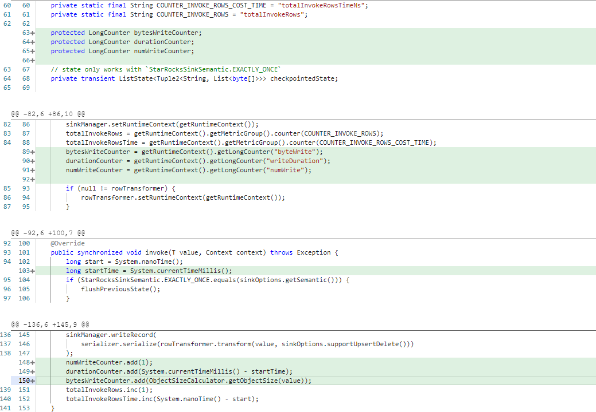

# StarRocks Sink

## 一、介绍

StarRocks Sink插件支持向StarRocks数据库以Stream load方式写入数据

## 二、支持版本

StarRocks 1.19 +

## 三、插件名称

| Sync | starrockssink、starrockswriter |
| --- | --- |
| SQL | starrocks-x |

## 四、参数说明

### 1、Sync

- **connection**
    - 描述：数据库连接参数，包含jdbcUrl、schema、table等参数
    - 必选：是
    - 参数类型：List
    - 默认值：无
      ```text
      "connection": [{
       "jdbcUrl": ["jdbc:mysql://0.0.0.1:3306/database?useSSL=false"],
       "table": ["table"],
       "schema":"public"
      }]
      ```

 <br />

- **jdbcUrl**
    - 描述：针对关系型数据库的jdbc连接字符串,jdbcUrl参考文档：[MySQL官方文档](http://dev.mysql.com/doc/connector-j/en/connector-j-reference-configuration-properties.html)
    - 必选：是
    - 参数类型：string
    - 默认值：无
      <br />

- **schema**
    - 描述：数据库schema名
    - 必选：否
    - 参数类型：string
    - 默认值：无
      <br />

- **table**
    - 描述：目的表的表名称。目前只支持配置单个表，后续会支持多表
    - 必选：是
    - 参数类型：List
    - 默认值：无
      <br />

- **username**
    - 描述：数据源的用户名
    - 必选：是
    - 参数类型：String
    - 默认值：无
      <br />

- **password**
    - 描述：数据源指定用户名的密码
    - 必选：是
    - 参数类型：String
    - 默认值：无
      <br />

- **column**
    - 描述：目的表需要写入数据的字段。例如: "column": [{"name":"id",type:"varchar"}]
    - 必选：是
    - 参数类型：List
    - 默认值：无
      <br />

- **fullColumn**
    - 描述：目的表中的所有字段，字段之间用英文逗号分隔。例如: "column": ["id","name","age","hobby"]，如果不配置，将在系统表中获取
    - 必选：否
    - 参数类型：List
    - 默认值：无
      <br />

- **preSql**
    - 描述：写入数据到目的表前，会先执行这里的一组标准语句
    - 必选：否
    - 参数类型：List
    - 默认值：无
      <br />

- **loadUrl**
    - 描述：FE地址， 例如：fe_ip:http_port， 多个地址分号连接
    - 必选：是
    - 参数类型：String
    - 默认值：无
      <br />

- **primaryKey**
    - 描述：当向带有主键模型的表写入时，需要指定此参数的值
    - 必选：否
    - 参数类型：List<String>
        - 示例："primaryKey": ["id"]
    - 默认值：无
      <br />

### 2、SQL

- **connector**
    - 描述：starrocks-x
    - 必选：是
    - 参数类型：String
    - 默认值：无
      <br />

- **jdbc-url**
    - 描述：jdbc:mysql://localhost:3306/test
    - 必选：是
    - 参数类型：String
    - 默认值：无
      <br />

- **load-url**
    - 描述：FE地址，例如：localhost:8030
    - 必选：是
    - 参数类型：String
    - 默认值：无
      <br />

- **database-name**
    - 描述：库名
    - 必选：是
    - 参数类型：String
    - 默认值：无：
      <br />

- **table-name**
    - 描述：表名
    - 必选：是
    - 参数类型：String
    - 默认值：无：
      <br />

- **username**
    - 描述：username
    - 必选：是
    - 参数类型：String
    - 默认值：无
      <br />

- **password**
    - 描述：password
    - 必选：是
    - 参数类型：String
    - 默认值：无
      <br />

- **sink.buffer-flush.max-rows**
    - 描述：批量写数据条数，单位：条
    - 必选：否
    - 参数类型：String
    - 默认值：1024
      <br />

- **sink.buffer-flush.interval**
    - 描述：批量写时间间隔，单位：毫秒
    - 必选：否
    - 参数类型：String
    - 默认值：10000
      <br />

- **sink.all-replace**
    - 描述：是否全部替换数据库中的数据(如果数据库中原值不为null,新值为null,如果为true则会替换为null)
    - 必选：否
    - 参数类型：String
    - 默认值：false
      <br />

- **sink.parallelism**
    - 描述：写入结果的并行度
    - 必选：否
    - 参数类型：String
    - 默认值：无
      <br />

- **sink.semantic**
    - 描述：sink端是否支持二阶段提交
    - 注意：
        - 如果此参数为空，默认不开启二阶段提交，即sink端不支持exactly_once语义；
        - 当前只支持exactly-once 和at-least-once
    - 必选：否
    - 参数类型：String
        - 示例："semantic": "exactly-once"
    - 默认值：at-least-once
      <br />

## 五、数据类型

| 支持 | BOOLEAN、TINYINT、SMALLINT、INT、BIGINT、FLOAT、DOUBLE、DECIMAL、STRING、VARCHAR、CHAR、TIMESTAMP、DATE、BINARY |
| --- | --- |
| 暂不支持 | ARRAY、MAP、STRUCT、UNION |

## 六、脚本示例

见项目内`flinkx-examples`文件夹。

## 七、写入相关统计指标为空

当调用flink-connector-starrocks写入数据时，默认情况是不会更新chunjun里写入统计指标数据，需要修改flink-connector-starrocks的相关源码， 以 1.1.13_flink-1.12 版本为例，修改 StarRocksDynamicSinkFunction.java 的相关代码如下：

```
protected LongCounter bytesWriteCounter;
protected LongCounter durationCounter;
protected LongCounter numWriteCounter;
    
bytesWriteCounter = getRuntimeContext().getLongCounter("byteWrite");
durationCounter = getRuntimeContext().getLongCounter("writeDuration");
numWriteCounter = getRuntimeContext().getLongCounter("numWrite");
        
long startTime = System.currentTimeMillis();
        
numWriteCounter.add(1);
durationCounter.add(System.currentTimeMillis() - startTime);
bytesWriteCounter.add(ObjectSizeCalculator.getObjectSize(value));
```

具体代码位置如图:
<div align=center>

</div>

