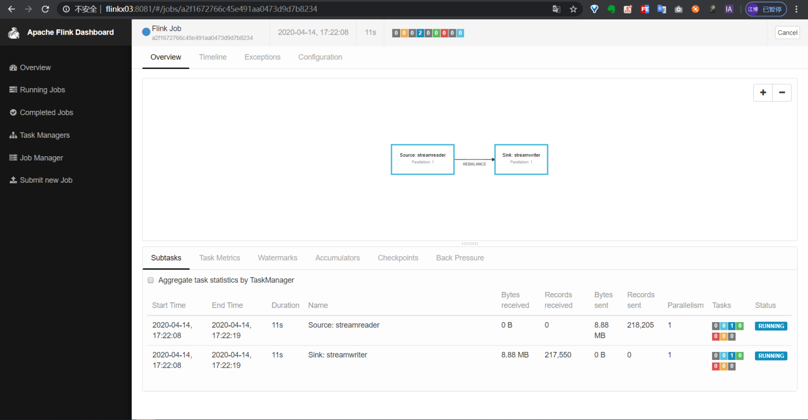
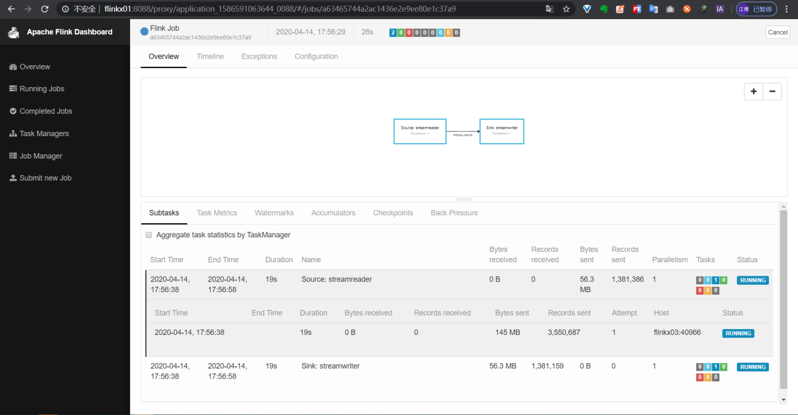

## 下载代码

1.使用git工具把项目clone到本地

```
git clone https://github.com/DTStack/flinkx.git
cd flinkx
```

2.直接下载源码

```
wget https://github.com/DTStack/flinkx/archive/1.11_release.zip
unzip 1.11_release.zip
cd 1.11_release
```

3.直接下载源码和编译好的插件包(推荐)
```
wget https://github.com/DTStack/flinkx/releases/download/1.11.0/flinkx.7z
7za x flinkx.7z
cd flinkx
```

## 编译插件

```bash
mvn clean package -DskipTests
```

## 常见问题

### 1.编译找不到DB2、达梦、gbase、ojdbc8等驱动包

解决办法：在$FLINKX_HOME/jars目录下有这些驱动包，可以手动安装，也可以使用插件提供的脚本安装：

```bash
## windows平台
./install_jars.bat

## unix平台
./install_jars.sh
```

## 运行任务

首先准备要运行的任务json，这里以stream插件为例：

```json
{
  "job" : {
    "content" : [ {
      "reader": {
        "name": "streamreader",
        "parameter": {
          "column": [
            {
              "name": "id",
              "type": "int"
            },
            {
              "name": "name",
              "type": "string"
            }
          ]
        }
      },
      "writer" : {
        "parameter" : {
          "print": false
        },
        "name" : "streamwriter"
      }
    } ],
    "setting" : {
      "restore" : {
        "isRestore" : false,
        "isStream" : false
      },
      "errorLimit" : {
      },
      "speed" : {
        "channel" : 1
      }
    }
  }
}
```

### Local模式运行任务

命令模板：

```bash
bin/flinkx \
	-mode local \
	-job docs/example/stream_stream.json \
	-pluginRoot syncplugins
```

可以在flink的配置文件里配置端口：

```bash
## web服务端口，不指定的话会随机生成一个
rest.bind-port: 8888
```

使用下面的命令运行任务：

```bash
bin/flinkx \
	-mode local \
	-job docs/example/stream_stream.json \
	-pluginRoot syncplugins
```

任务运行后可以通过8888端口访问flink界面查看任务运行情况：

<div align=center>
  
</div>

### Standalone模式运行

命令模板：

```bash
bin/flinkx \
	-mode standalone \
	-job docs/example/stream_stream.json \
	-pluginRoot syncplugins \
	-flinkconf $FLINK_HOME/conf \
	-confProp "{\"flink.checkpoint.interval\":60000}"
```

首先启动flink集群：

```bash
# flink集群默认端口是8081
$FLINK_HOME/bin/start-cluster.sh
```

通过8081端口检查集群是否启动成功

<div align=center>
  
</div>

把任务提交到集群上运行：

```bash
./bin/flinkx \
	-mode standalone \
	-job docs/example/stream_stream.json \
	-flinkconf $FLINK_HOME/conf
```

在集群上查看任务运行情况

<div align=center>
  
</div>

### 以Yarn Session模式运行任务

命令示例：

```bash
bin/flinkx \
	-mode yarn \
	-job docs/example/stream_stream.json \
	-pluginRoot syncplugins \
	-flinkconf $FLINK_HOME/conf \
	-yarnconf $HADOOP_HOME/etc/hadoop \
	-confProp "{\"flink.checkpoint.interval\":60000}"
```

首先确保yarn集群是可用的，然后手动启动一个yarn session：

```bash
$FLINK_HOME/bin/yarn-session.sh -n 1 -s 2 -jm 1024 -tm 1024
```

<div align=center>
  
</div>

<div align=center>
  
</div>

把任务提交到这个yarn session上：

```bash
bin/flinkx \
	-mode yarn \
	-job docs/example/stream_stream.json \
	-flinkconf $FLINK_HOME/conf \
	-yarnconf $HADOOP_HOME/etc/hadoop
```

然后在flink界面查看任务运行情况：

<div align=center>
  
</div>

### 以Yarn Perjob模式运行任务

命令示例：

```bash
bin/flinkx \
	-mode yarnPer \
	-job docs/example/stream_stream.json \
	-pluginRoot syncplugins \
	-flinkconf $FLINK_HOME/conf \
	-yarnconf $HADOOP_HOME/etc/hadoop \
	-flinkLibJar $FLINK_HOME/lib \
	-confProp "{\"flink.checkpoint.interval\":60000}" \ 
	-queue default \
	-pluginLoadMode classpath
```

首先确保yarn集群是可用的，启动一个Yarn Application运行任务:

```bash
bin/flinkx \
	-mode yarnPer \
	-job docs/example/stream_stream.json \
	-pluginRoot syncplugins \
	-yarnconf $HADOOP_HOME/etc/hadoop \
	-flinkLibJar $FLINK_HOME/lib \
	-pluginLoadMode classpath
```

然后在集群上查看任务运行情况

<div align=center>
  
</div>

<div align=center>
  
</div>

## 参数说明

| 名称                 | 说明                                                     | 可选值                                                                                                                                                                                                                                         | 是否必填 | 默认值                     |
| ------------------ | ------------------------------------------------------ | ------------------------------------------------------------------------------------------------------------------------------------------------------------------------------------------------------------------------------------------- | ---- | ----------------------- |
| **mode**          | 执行模式，也就是flink集群的工作模式                                   | 1.**local**: 本地模式<br />2.**standalone**: 独立部署模式的flink集群<br />3.**yarn**: yarn模式的flink集群，需要提前在yarn上启动一个flink session，使用默认名称"Flink session cluster"<br />4.**yarnPer**: yarn模式的flink集群，单独为当前任务启动一个flink session，使用默认名称"Flink per-job cluster" | 否    | local                   |
| **job**            | 数据同步任务描述文件的存放路径；该描述文件中使用json字符串存放任务信息                  | 无                                                                                                                                                                                                                                           | 是    | 无                       |
| **jobid**          | 任务名称                                                   | 无                                                                                                                                                                                                                                           | 否    | Flink Job               |
| **pluginRoot**     | 插件根目录地址，也就是打包后产生的pluginRoot目录。                         | 无                                                                                                                                                                                                                                           | 否    | $FLINKX_HOME/syncplugins    |
| **flinkconf**      | flink配置文件所在的目录（单机模式下不需要）                               | $FLINK_HOME/conf                                                                                                                                                                                                                            | 否    | $FLINK_HOME/conf        |
| **flinkLibJar**    | flink lib所在的目录（单机模式下不需要），如/opt/dtstack/flink-1.11.3/lib | $FLINK_HOME/lib                                                                                                                                                                                                                             | 否    | $FLINK_HOME/lib         |
| **yarnconf**       | Hadoop配置文件（包括hdfs和yarn）所在的目录                           | $HADOOP_HOME/etc/hadoop                                                                                                                                                                                                                     | 否    | $HADOOP_HOME/etc/hadoop |
| **queue**          | yarn队列，如default                                        | 无                                                                                                                                                                                                                                           | 否    | default                 |
| **pluginLoadMode** | yarn session模式插件加载方式                                   | 1.**classpath**：提交任务时不上传插件包，需要在yarn-node节点pluginRoot目录下部署插件包，但任务启动速度较快<br />2.**shipfile**：提交任务时上传pluginRoot目录下部署插件包的插件包，yarn-node节点不需要部署插件包，任务启动速度取决于插件包的大小及网络环境                                                                           | 否    | shipfile                |
| **confProp**       | checkpoint配置                                           | **flink.checkpoint.interval**：快照生产频率<br />**flink.checkpoint.stateBackend**：快照存储路径                                                                                                                                                          | 否    | 无                       |
| **s**              | checkpoint快照路径                                         |                                                                                                                                                                                                                                             | 否    | 无                       |
| **p**              | 自定义入参，用于替换脚本中的占位符，如脚本中存在占位符${pt1},${pt2}，则该参数可配置为pt1=20200101,pt2=20200102|                                                                                                                                                                                                                                             | 否    | 无                       |
| **appId**              | yarn模式下，提交到指定的的flink session的application Id                                        |                                                                                                                                                                                                                                             | 否    | 无                       |
| **krb5conf**              | 提交到开启kerberos的Hadoop集群的krb5文件路径                                        |                                                                                                                                                                                                                                             | 否    | 无                       |
| **keytab**              | 提交到开启kerberos的Hadoop集群的keytab文件路径                                        |                                                                                                                                                                                                                                             | 否    | 无                       |
| **principal**              | kerberos认证的principal                                        |                                                                                                                                                                                                                                             | 否    | 无                       |

