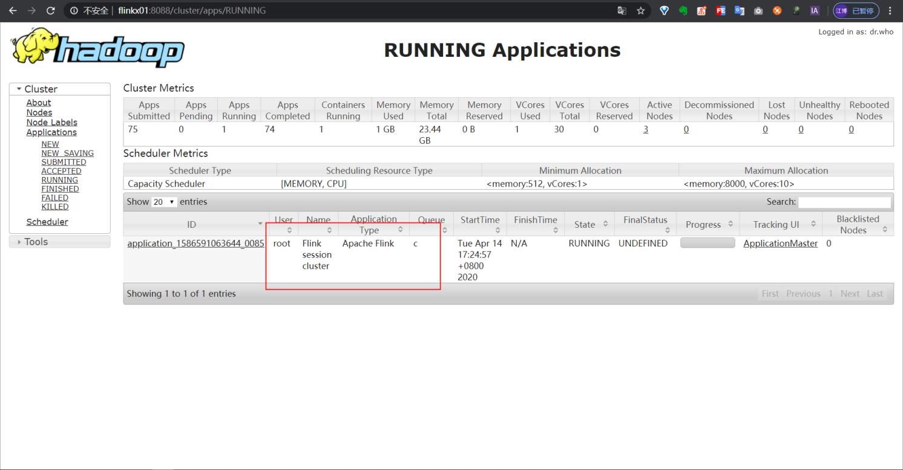

## 下载代码

1.使用git工具把项目clone到本地

```
git clone https://github.com/DTStack/chunjun.git
cd chunjun
```

## 编译插件
在chunjun home目录下执行

```bash
mvn clean package -DskipTests 
```
或者执行
```bash
sh build/build.sh
```

## 常见问题

### 1.编译找不到DB2、达梦、gbase、ojdbc8等驱动包

解决办法：在$CHUNJUN_HOME/jars目录下有这些驱动包，可以手动安装，也可以使用插件提供的脚本安装：

```bash
## windows平台
./$CHUNJUN_HOME/bin/install_jars.bat

## unix平台
./$CHUNJUN_HOME/bin/install_jars.sh
```

## 运行任务
**NOTE:项目中的chunjun-examples模块下提供了大量 [数据同步案例](chunjun-examples/json) 和 [SQL案例](chunjun-examples/sql)**

#### 数据同步任务

首先准备要运行的任务json，这里以stream插件为例(**`chunjun-examples`文件夹下有大量案例**)：

```json
{
  "job": {
    "content": [
      {
        "reader": {
          "parameter": {
            "column": [
              {
                "name": "id",
                "type": "id"
              },
              {
                "name": "name",
                "type": "string"
              },
              {
                "name": "content",
                "type": "string"
              }
            ],
            "sliceRecordCount": ["30"],
            "permitsPerSecond": 1
          },
          "table": {
            "tableName": "sourceTable"
          },
          "name": "streamreader"
        },
        "writer": {
          "parameter": {
            "column": [
              {
                "name": "id",
                "type": "id"
              },
              {
                "name": "name",
                "type": "string"
              },
              {
                "name": "content",
                "type": "timestamp"
              }
            ],
            "print": true
          },
          "table": {
            "tableName": "sinkTable"
          },
          "name": "streamwriter"
        },
        "transformer": {
          "transformSql": "select id,name, NOW() from sourceTable where CHAR_LENGTH(name) < 50 and CHAR_LENGTH(content) < 50"
        }
      }
    ],
    "setting": {
      "errorLimit": {
        "record": 100
      },
      "speed": {
        "bytes": 0,
        "channel": 1,
        "readerChannel": 1,
        "writerChannel": 1
      }
    }
  }
}
```
#### flinksql任务

***NOTE：ChunJun和flinkSql connector[共用](docs/conectorShare.md)***<br /><br />
或者准备要运行的flinksql任务，这里以stream插件为例(**`chunjun-examples`文件夹下有大量案例**)：

```sql
CREATE TABLE source
(
    id        INT,
    name      STRING,
    money     DECIMAL(32, 2),
    dateone   timestamp,
    age       bigint,
    datethree timestamp,
    datesix   timestamp(6),
    datenigth timestamp(9),
    dtdate    date,
    dttime    time
) WITH (
      'connector' = 'stream-x',
      'number-of-rows' = '10', -- 输入条数，默认无限
      'rows-per-second' = '1' -- 每秒输入条数，默认不限制
      );

CREATE TABLE sink
(
    id        INT,
    name      STRING,
    money     DECIMAL(32, 2),
    dateone   timestamp,
    age       bigint,
    datethree timestamp,
    datesix   timestamp(6),
    datenigth timestamp(9),
    dtdate    date,
    dttime    time
) WITH (
      'connector' = 'stream-x',
      'print' = 'true'
      );

insert into sink
select *
from source;
```

### Local模式运行任务

命令模板：

```bash
bin/start-chunjun \
	-mode local \
	-jobType sync \
	-job chunjun-examples/json/stream/stream.json \
	-chunjunDistDir chunjun-dist 
```

可以在flink-conf.yaml配置文件里配置端口：

```bash
## web服务端口，不指定的话会随机生成一个
rest.bind-port: 8888
```

使用下面的命令运行任务：

```bash
bin/start-chunjun \
	-mode local \
	-jobType sync \
	-job chunjun-examples/json/stream/stream.json \
	-chunjunDistDir chunjun-dist 
```

任务运行后可以通过8888端口访问flink界面查看任务运行情况：

<div align=center>
  
</div>

### Standalone模式运行
NOTE:将chunjun-dist目录拷贝到$FLINK_HOME/lib下，并修改$FLINK_HOME/conf/flink-conf.yml中的classloader为classloader.resolve-order: parent-first

命令模板：

```bash
bin/start-chunjun \
	-mode standalone \
	-jobType sync \
	-job chunjun-examples/json/stream/stream.json \
	-chunjunDistDir chunjun-dist  \
	-flinkConfDir $FLINK_HOME/conf \
	-confProp "{\"flink.checkpoint.interval\":60000}"
```

首先启动flink集群：

```bash
# flink集群默认端口是8081
$FLINK_HOME/bin/start-cluster.sh
```

通过8081端口检查集群是否启动成功

<div align=center>
  
</div>

把任务提交到集群上运行：

```bash
./bin/start-chunjun \
	-mode standalone \
	-jobType sync \
	-chunjunDistDir chunjun-dist  \
	-job chunjun-examples/json/stream/stream.json \
	-flinkConfDir $FLINK_HOME/conf
```

在集群上查看任务运行情况

<div align=center>
  
</div>

### 以Yarn Session模式运行任务
NOTE:可以先在现在chunjun-clients模块YarnSessionClientUtil类中启动一个session，然后修改$FLINK_HOME/conf/flink-conf.yml中的classloader为classloader.resolve-order: parent-first

命令示例：

```bash
bin/start-chunjun \
	-mode yarn-session \
	-jobType sync \
	-job chunjun-examples/json/stream/stream.json \
	-chunjunDistDir chunjun-dist  \
	-flinkConfDir $FLINK_HOME/conf \
	-hadoopConfDir $HADOOP_HOME/etc/hadoop \
	-confProp "{\"flink.checkpoint.interval\":60000}"
```

首先确保yarn集群是可用的，然后手动启动一个yarn session：

```bash
$FLINK_HOME/bin/yarn-session.sh -n 1 -s 1 -jm 1024 -tm 1024
```

<div align=center>
  
</div>

<div align=center>
  
</div>

把任务提交到这个yarn session上：

```bash
bin/start-chunjun \
	-mode yarn-session \
	-jobType sync \
	-job chunjun-examples/json/stream/stream.json \
	-flinkConfDir $FLINK_HOME/conf \
	-chunjunDistDir chunjun-dist  \
	-hadoopConfDir $HADOOP_HOME/etc/hadoop
```

然后在flink界面查看任务运行情况：

<div align=center>
  
</div>

### 以Yarn Perjob模式运行任务

命令示例：

```bash
bin/start-chunjun \
	-mode yarn-per-job \
	-jobType sync \
	-job chunjun-examples/json/stream/stream.json \
	-chunjunDistDir chunjun-dist  \
	-flinkConfDir $FLINK_HOME/conf \
	-hadoopConfDir $HADOOP_HOME/etc/hadoop \
	-flinkLibDir $FLINK_HOME/lib \
	-confProp "{\"flink.checkpoint.interval\":60000,\"yarn.application.queue\":\"default\"}" \ 
```

首先确保yarn集群是可用的，启动一个Yarn Application运行任务:

```bash
bin/start-chunjun \
	-mode yarn-per-job \
	-jobType sync \
	-job chunjun-examples/json/stream/stream.json \
	-chunjunDistDir chunjun-dist  \
	-hadoopConfDir $HADOOP_HOME/etc/hadoop \
	-flinkLibDir $FLINK_HOME/lib \
```

然后在集群上查看任务运行情况

<div align=center>
  
</div>

<div align=center>
  
</div>


### Kubernetes Session模式运行任务

命令示例：

```
bin/start-chunjun \
    -mode kubernetes-session \
    -jobType sync \
    -job chunjun-examples/json/stream/stream.json \
    -jobName kubernetes-job \
    -jobType sync \
    -chunjunDistDir chunjun-dist  \
    -flinkLibDir $FLINK_HOME/lib \
    -flinkConfDir $FLINK_HOME/conf \
    -confProp "{\"kubernetes.config.file\":\"${kubernetes_config_path}\",\"kubernetes.cluster-id\":\"${cluster_id}\",\"kubernetes.namespace\":\"${namespace}\"}"
```

需要提前手动在kubernetes上启动kubernetes session
```
$FLINK_HOME/bin/kubernetes-session.sh -Dkubernetes.cluster-id=flink-session-test -Dclassloader.resolve-order=parent-first -Dkubernetes.container.image=${image_name}
```
注意：需要提前构建chunjun镜像
[chunjun镜像构建说明](chunjun-docker/docker/README.md)

### Kubernetes Application模式运行任务

命令示例：
```
bin/start-chunjun \
    -mode kubernetes-application \
    -jobType sync \
    -job chunjun-examples/json/stream/stream.json \
    -jobName kubernetes-job \
    -jobType sync \
    -chunjunDistDir chunjun-dist  \
    -remotePluginPath /opt/chunjun-dist \
    -pluginLoadMode classpath \
    -flinkLibDir $FLINK_HOME/lib \
    -flinkConfDir $FLINK_HOME/conf \
    -confProp "{\"kubernetes.config.file\":\"${kubernetes_config_path}\",\"kubernetes.container.image\":\"${image_name}\",\"kubernetes.namespace\":\"${namespace}\"}"
```
注意：需要提前构建chunjun镜像
[chunjun镜像构建说明](chunjun-docker/docker/README.md)

## 参数说明

| 名称                 | 说明                                                     | 可选值                                                                                                                                                                                                                                         | 是否必填 | 默认值                     |
| ------------------ | ------------------------------------------------------ | ------------------------------------------------------------------------------------------------------------------------------------------------------------------------------------------------------------------------------------------- | ---- | ----------------------- |
| **mode**          | 执行模式，也就是flink集群的工作模式      | 1.**local**: 本地模式<br />2.**standalone**: 独立部署模式的flink集群<br />3.**yarn-session**: yarn-session模式的flink集群，需要提前在yarn上启动一个flink session，使用默认名称"Flink session cluster"<br />4.**yarn-per-job**: yarn模式的flink集群，单独为当前任务启动一个flink session，使用默认名称"Flink per-job cluster"<br />5.**kubernetes-session**: kubernetes session模式提交任务，需要提前在kubernetes上启动flink session <br />6.**kubernetes-application**: kubernetes run application模式提交任务 | 否    | local                   |
| **jobType**        | 任务类型                 | 1.**sync**:数据同步任务<br />    2.**sql**:flinksql任务                                                                                                                                                                                                                                      | 是    | 无                       |
| **job**            | 同步、flinksql任务描述文件的存放路径；该描述文件中使用json、sql存放任务信息                  | 无                                                                                                                                                                                                                                           | 是    | 无                       |
| **jobName**          | 任务名称                                                   | 无                                                                                                                                                                                                                                           | 否    | Flink Job               |
| **chunjunDistDir**     | 插件根目录地址，也就是打包后产生的chunjun-dist目录。                         | 无                                                                                                                                                                                                                                           | 否    | $CHUNJUN_HOME/chunjun-dist    |
| **flinkConfDir**      | flink配置文件所在的目录（单机模式下不需要）                               | $FLINK_HOME/conf                                                                                                                                                                                                                            | 否    | $FLINK_HOME/conf        |
| **flinkLibDir**    | flink lib所在的目录（单机模式下不需要），如/opt/dtstack/flink-1.10.1/lib | $FLINK_HOME/lib                                                                                                                                                                                                                             | 否    | $FLINK_HOME/lib         |
| **hadoopConfDir**       | Hadoop配置文件（包括hdfs和yarn）所在的目录                           | $HADOOP_HOME/etc/hadoop                                                                                                                                                                                                                     | 否    | $HADOOP_HOME/etc/hadoop |
| **pluginLoadMode** | yarn session模式插件加载方式                                   | 1.**classpath**：提交任务时不上传插件包，需要在yarn-node节点chunjun-dist目录下部署插件包，但任务启动速度较快，session模式建议使用<br />2.**shipfile**：提交任务时上传chunjun-dist目录下部署插件包的插件包，yarn-node节点不需要部署插件包，任务启动速度取决于插件包的大小及网络环境，yarnPer模式建议使用                                                                           | 否    | shipfile                |
| **confProp**       | flink官方所有配置参数                                           |                                                                                                                                                           | 否    | 无                       |
| **p**              | 自定义入参，用于替换脚本中的占位符，如脚本中存在占位符${pt1},${pt2}，则该参数可配置为pt1=20200101,pt2=20200102|                                                                                                                                                                                                                                             | 否    | 无                       |
