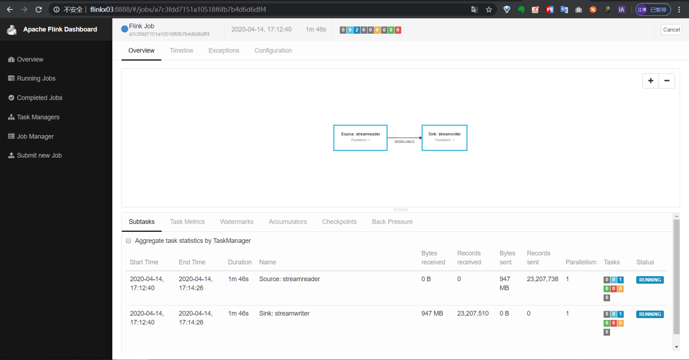
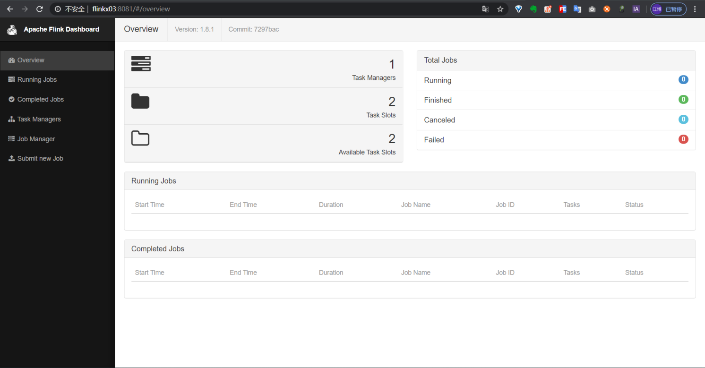
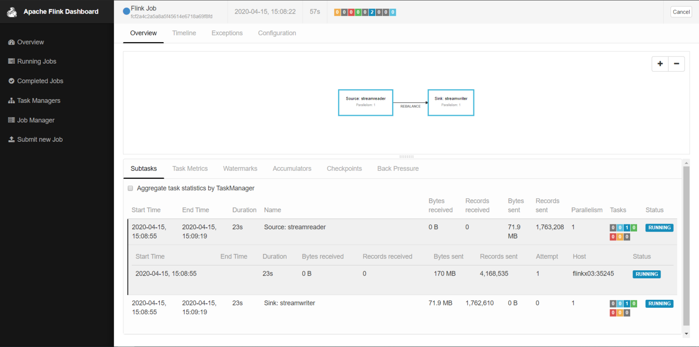

目录：
<!-- TOC -->

- [下载代码](#下载代码)
- [编译插件](#编译插件)
    - [1.编译找不到DB2、达梦、gbase、ojdbc8、kingbase、vertica等驱动包](#1编译找不到db2达梦gbaseojdbc8kingbasevertica等驱动包)
    - [2.编译报错找不到其他包](#2编译报错找不到其他包)
- [运行任务](#运行任务)
    - [Local模式运行任务](#local模式运行任务)
    - [Standalone模式运行](#standalone模式运行)
    - [以Yarn Session模式运行任务](#以yarn-session模式运行任务)
    - [以Yarn Perjob模式运行任务](#以yarn-perjob模式运行任务)
- [参数说明](#参数说明)

<!-- /TOC -->

## 下载代码

1.使用git工具把项目clone到本地

```
git clone https://github.com/DTStack/flinkx.git
cd flinkx
```

2.直接下载源码

```
wget https://github.com/DTStack/flinkx/archive/1.10_release.zip
unzip 1.10_release.zip
cd flinkx-1.10_release
```

## 编译插件

```bash
mvn clean package -DskipTests
```

对于不需要的插件，可以修改$FLINKX_HOME目录下的pom文件，可以将不需要的模块和`flinkx-test`模块注释掉，在编译时将不会编译该插件，这样可以缩短编译时间.

注：**部分模块有依赖关系，请注意**。若遇到这种情况，请根据maven报错提示，将对应依赖的模块取消注释。

```xml
 <modules>
    <module>flinkx-core</module>

    <module>flinkx-launcher</module>
    <module>flinkx-test</module>
    <module>flinkx-stream</module>

    <!--******离线******-->
    <module>flinkx-rdb</module>
    <module>flinkx-mysql</module>
    <module>flinkx-polardb</module>
    <module>flinkx-oracle</module>
    <module>flinkx-sqlserver</module>
    <module>flinkx-postgresql</module>
    <module>flinkx-db2</module>
    <module>flinkx-dm</module>
    <module>flinkx-gbase</module>
    <module>flinkx-clickhouse</module>
    <module>flinkx-saphana</module>
    <module>flinkx-teradata</module>
    <module>flinkx-greenplum</module>
    <module>flinkx-kingbase</module>

    <module>flinkx-hdfs</module>
    <module>flinkx-hive</module>
    <module>flinkx-es</module>
    <module>flinkx-ftp</module>
    <module>flinkx-odps</module>
    <module>flinkx-hbase</module>
    <module>flinkx-phoenix5</module>
    <module>flinkx-carbondata</module>
    <module>flinkx-kudu</module>
    <module>flinkx-cassandra</module>

    <module>flinkx-redis</module>
    <module>flinkx-mongodb</module>

    <!--******实时******-->
    <module>flinkx-binlog</module>
    <module>flinkx-kb</module>
    <module>flinkx-kafka09</module>
    <module>flinkx-kafka10</module>
    <module>flinkx-kafka11</module>
    <module>flinkx-kafka</module>
    <module>flinkx-emqx</module>
    <module>flinkx-pulsar</module>
    <module>flinkx-pgwal</module>
    <module>flinkx-restapi</module>
    <module>flinkx-oraclelogminer</module>
</modules>
```

### 1.编译找不到DB2、达梦、gbase、ojdbc8、kingbase、vertica等驱动包

解决办法：在$FLINKX_HOME/jars目录下有这些驱动包，可以手动安装，也可以使用$FLINKX_HOME/bin目录下的脚本安装：

```bash
## windows平台
./install_jars.bat

## unix平台
./install_jars.sh
```

### 2.编译报错找不到其他包

解决办法：在$FLINKX_HOME/jars目录下有maven的setting文件，内容如下，**修改仓库路径**后替换本地maven的setting文件，重新安装[步骤一](#1.编译找不到DB2、达梦、gbase、ojdbc8、kingbase、vertica等驱动包)中的驱动包，然后再编译插件
```xml
<?xml version="1.0" encoding="UTF-8"?>
<settings xmlns="http://maven.apache.org/SETTINGS/1.0.0"
          xmlns:xsi="http://www.w3.org/2001/XMLSchema-instance"
          xsi:schemaLocation="http://maven.apache.org/SETTINGS/1.0.0 http://maven.apache.org/xsd/settings-1.0.0.xsd">

    <!--maven仓库jar包存放路径，改成你自己的路径-->
    <localRepository>/home/apache-maven-3.6.1/repository</localRepository>

    <mirrors>
        <mirror>
            <id>alimaven</id>
            <name>aliyun maven</name>
            <url>http://maven.aliyun.com/nexus/content/groups/public/</url>
            <mirrorOf>central</mirrorOf>
        </mirror>
    </mirrors>

</settings>
```

## 运行任务

首先准备要运行的任务json，这里以stream插件为例：

```json
{
  "job" : {
    "content" : [ {
      "reader" : {
        "parameter" : {
          "column" : [ {
            "name": "id",
            "type" : "id"
          }, {
            "name": "string",
            "type" : "string"
          } ],
          "sliceRecordCount" : [ "10"]
        },
        "name" : "streamreader"
      },
      "writer" : {
        "parameter" : {
          "print" : true
        },
        "name" : "streamwriter"
      }
    } ],
    "setting" : {
      "speed" : {
        "channel" : 1
      }
    }
  }
}
```

<br />

### Local模式运行任务

命令模板：

```bash
bin/flinkx \
  -mode local \
  -job docs/example/stream_stream.json \
  -pluginRoot syncplugins \
  -flinkconf flinkconf
```

修改flink配置文件，指定web UI端口
```bash
vi flinkconf/flink-conf.yaml
```

```yml
## web服务端口，不指定的话会随机生成一个
rest.bind-port: 8888
```

使用下面的命令运行任务：

```bash
bin/flinkx \
  -mode local \
  -job docs/example/stream_stream.json \
  -pluginRoot syncplugins \
  -flinkconf flinkconf
```

任务运行后可以通过8888端口访问flink界面查看任务运行情况：

<div align=center>
  
</div>

<br />

### [Standalone模式运行任务](standaLoneQuickStart.md)

命令模板：

```bash
bin/flinkx \
	-mode standalone \
	-job docs/example/stream_stream.json \
	-pluginRoot syncplugins \
	-flinkconf $FLINK_HOME/conf \
	-confProp "{\"flink.checkpoint.interval\":60000}"
```

首先启动flink集群：

```bash
# flink集群默认端口是8081
$FLINK_HOME/bin/start-cluster.sh
```

通过8081端口检查集群是否启动成功

<div align=center>
  
</div>

把任务提交到集群上运行：

```bash
./bin/flinkx \
	-mode standalone \
	-job docs/example/stream_stream.json \
	-flinkconf $FLINK_HOME/conf
```

在集群上查看任务运行情况

<div align=center>
  
</div>

<br />

### 以Yarn Session模式运行任务

命令示例：

```bash
bin/flinkx \
	-mode yarn \
	-job docs/example/stream_stream.json \
	-pluginRoot syncplugins \
	-flinkconf $FLINK_HOME/conf \
	-yarnconf $HADOOP_HOME/etc/hadoop \
	-confProp "{\"flink.checkpoint.interval\":60000}"
```

[下载](https://mvnrepository.com/artifact/org.apache.flink/flink-shaded-hadoop-2-uber)对应Hadoop版本的flink shade包，放入$FLINK_HOME/lib目录下(从flink1.11开始官方不再提供打包好的flink shade包，需要自行[下载](https://github.com/apache/flink-shaded)打包)

[下载](https://mvnrepository.com/artifact/org.apache.flink/flink-metrics-prometheus)对应版本的flink prometheus包，放入$FLINK_HOME/lib目录下

修改flink配置文件，指定flink类加载方式
```bash
vi ../conf/flink-conf.yaml
```

```yml
## flink类加载方式，指定为父类优先
classloader.resolve-order: parent-first
```

确保yarn集群是可用的，然后手动启动一个yarn session：

注：-ship: 启动flink session时上传FlinkX插件包，这样只需要在提交FlinkX任务的节点部署FlinkX插件包，其他服务器节点不需要部署，同时更换FlinkX插件包后需要重启yarn session，需要配合修改flink的类加载方式。

```bash
nohup $FLINK_HOME/bin/yarn-session.sh -qu a -ship $FLINKX_HOME/syncplugins/ &
```

<div align=center>
  
</div>

<div align=center>
  
</div>

把任务提交到这个yarn session上：

```bash
bin/flinkx \
	-mode yarn \
	-job docs/example/stream_stream.json \
	-flinkconf $FLINK_HOME/conf \
	-yarnconf $HADOOP_HOME/etc/hadoop \
	-queue a
```

然后在flink界面查看任务运行情况：

<div align=center>
  
</div>

<br />

### 以Yarn Perjob模式运行任务

命令示例：

```bash
bin/flinkx \
	-mode yarnPer \
	-job docs/example/stream_stream.json \
	-pluginRoot syncplugins \
	-flinkconf $FLINK_HOME/conf \
	-yarnconf $HADOOP_HOME/etc/hadoop \
	-flinkLibJar $FLINK_HOME/lib \
	-confProp "{\"flink.checkpoint.interval\":60000}" \ 
	-queue default
```

首先确保yarn集群是可用的，启动一个Yarn Application运行任务:

```bash
bin/flinkx \
	-mode yarnPer \
	-job docs/example/stream_stream.json \
	-pluginRoot $FLINK_HOME/conf \
	-yarnconf $HADOOP_HOME/etc/hadoop \
	-flinkLibJar $FLINK_HOME/lib \
	-queue a
```

然后在集群上查看任务运行情况

<div align=center>
  
</div>

<div align=center>
  
</div>

## 参数说明

| 名称                 | 说明                                                     | 可选值                                                                                                                                                                                                                                         | 是否必填 | 默认值                     |
| ------------------ | ------------------------------------------------------ | ------------------------------------------------------------------------------------------------------------------------------------------------------------------------------------------------------------------------------------------- | ---- | ----------------------- |
| **mode**          | 执行模式，也就是flink集群的工作模式                                   | 1.**local**: 本地模式<br />2.**standalone**: 独立部署模式的flink集群<br />3.**yarn**: yarn模式的flink集群，需要提前在yarn上启动一个flink session，使用默认名称"Flink session cluster"<br />4.**yarnPer**: yarn模式的flink集群，单独为当前任务启动一个flink session，使用默认名称"Flink per-job cluster" | 否    | local                   |
| **job**            | 数据同步任务描述文件的存放路径；该描述文件中使用json字符串存放任务信息                  | 无                                                                                                                                                                                                                                           | 是    | 无                       |
| **jobid**          | 指定flink任务名称                                                   | 无                                                                                                                                                                                                                                           | 否    | Flink Job               |
| **pluginRoot**     | 插件根目录地址，也就是打包后产生的pluginRoot目录。                         | 无                                                                                                                                                                                                                                           | 否    | $FLINKX_HOME/syncplugins    |
| **flinkconf**      | flink配置文件所在的目录                               | $FLINK_HOME/conf                                                                                                                                                                                                                            | 否    | $FLINK_HOME/conf        |
| **flinkLibJar**    | flink lib所在的目录（单机模式下不需要），如/opt/dtstack/flink-1.10.1/lib | $FLINK_HOME/lib                                                                                                                                                                                                                             | 否    | $FLINK_HOME/lib         |
| **yarnconf**       | Hadoop配置文件（包括hdfs和yarn）所在的目录                           | $HADOOP_HOME/etc/hadoop                                                                                                                                                                                                                     | 否    | $HADOOP_HOME/etc/hadoop |
| **queue**          | yarn队列，如default                                        | 无                                                                                                                                                                                                                                           | 否    | default                 |
| **pluginLoadMode** | yarn session模式插件加载方式                                   | 1.**classpath**：提交任务时不上传插件包，需要在yarn-node节点pluginRoot目录下部署插件包，但任务启动速度较快<br />2.**shipfile**：提交任务时上传pluginRoot目录下部署插件包的插件包，yarn-node节点不需要部署插件包，任务启动速度取决于插件包的大小及网络环境                                                                           | 否    | shipfile                |
| **confProp**       | flink额外配置，如checkpoint、内存                                           | **flink.checkpoint.interval**：快照生产频率(毫秒)<br />**flink.checkpoint.timeout**：快照超时时间(毫秒)<br />**jobmanager.memory.mb**：perJob模式下jobmanager内存设置<br />**taskmanager.memory.mb**：perJob模式下taskmanager内存设置<br />**taskmanager.slots**：perJob模式下jobmanager slots个数设置                                                                                                                                                          | 否    | 无                       |
| **s**              | checkpoint快照路径，设置后从该快照恢复任务                                         |                                                                                                                                                                                                                                             | 否    | 无                       |
| **p**              | 自定义入参，用于替换脚本中的占位符，如脚本中存在占位符${pt1},${pt2}，则该参数可配置为pt1=20200101,pt2=20200102|                                                                                                                                                                                                                                             | 否    | 无                       |
| **appId**          | yarn session模式下，提交到指定的的flink session的application Id                                        |                                                                                                                                                                                                                                             | 否    | 无                       |
| **krb5conf**       | 提交到开启kerberos的Hadoop集群的krb5文件路径                                        |                                                                                                                                                                                                                                             | 否    | 无                       |
| **keytab**         | 提交到开启kerberos的Hadoop集群的keytab文件路径                                        |                                                                                                                                                                                                                                             | 否    | 无                       |
| **principal**      | kerberos认证的principal                                        |                                                                                                                                                                                                                                             | 否    | 无                       |

