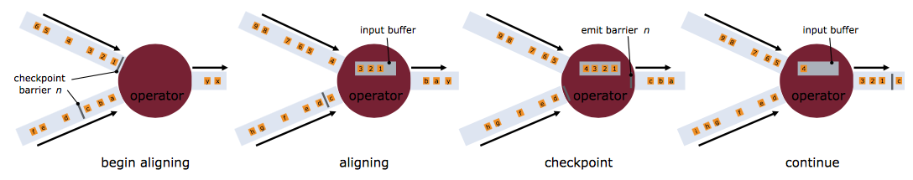
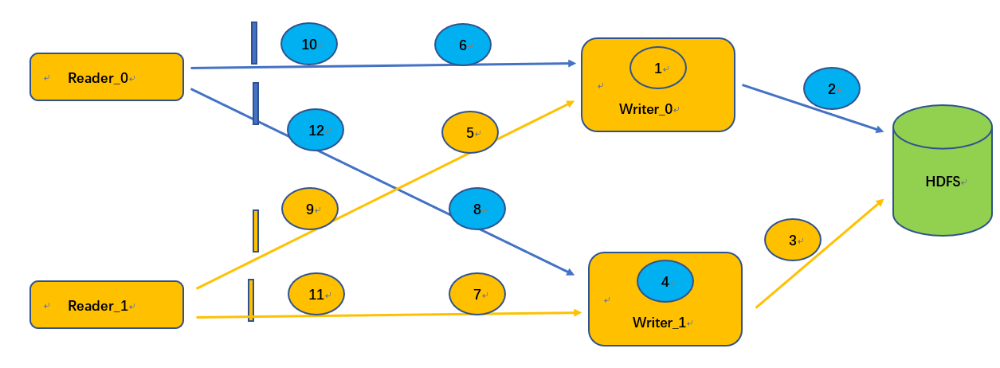
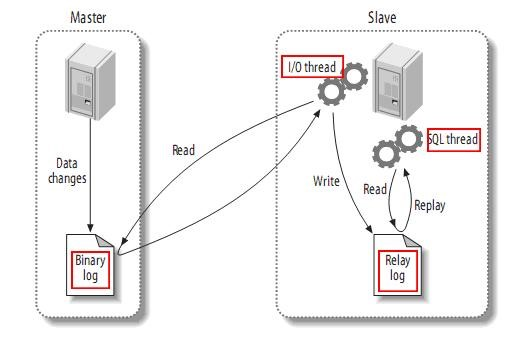
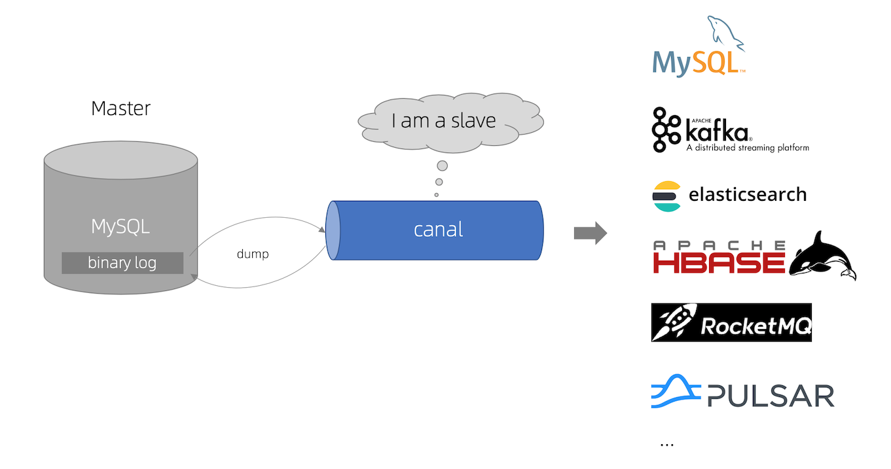
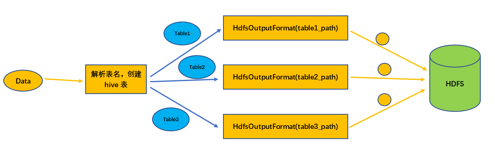

### 1.功能介绍

#### **1.1** **断点续传**

断点续传是指数据同步任务在运行过程中因各种原因导致任务失败，不需要重头同步数据，只需要从上次失败的位置继续同步即可，类似于下载文件时因网络原因失败，不需要重新下载文件，只需要继续下载就行，可以大大节省时间和计算资源。

#### **2.1** **实时采集**

根据数据源的数据是否实时变化可以把数据同步分为离线数据同步和实时数据同步，上面介绍的断点续传就是离线数据同步里的功能，实时采集其实就是实时数据同步，当数据源里的数据发生了增删改操作，同步任务监听到这些变化，将变化的数据实时同步到目标数据源。除了数据实时变化外，实时采集和离线数据同步的另一个区别是：实时采集任务是不会停止的，任务会一直监听数据源是否有变化。

### 2.Flink**中的checkpoint机制**

断点续传和实时采集都依赖于flink的checkpoint机制，这里简单介绍一下。 Checkpoint是Flink实现容错机制最核心的功能，它能够根据配置周期性地基于Stream中各个Operator的状态来生成Snapshot，从而将这些状态数据定期持久化存储下来，当Flink程序一旦意外崩溃时，重新运行程序时可以有选择地从这些Snapshot进行恢复，从而修正因为故障带来的程序数据状态中断。

<div align="center">
    
</div>

Checkpoint触发时，会向多个分布式的Stream Source中插入一个Barrier标记，这些Barrier会随着Stream中的数据记录一起流向下游的各个Operator。当一个Operator接收到一个Barrier时，它会暂停处理Steam中新接收到的数据记录。因为一个Operator可能存在多个输入的Stream，而每个Stream中都会存在对应的Barrier，该Operator要等到所有的输入Stream中的Barrier都到达。当所有Stream中的Barrier都已经到达该Operator，这时所有的Barrier在时间上看来是同一个时刻点（表示已经对齐），在等待所有Barrier到达的过程中，Operator的Buffer中可能已经缓存了一些比Barrier早到达Operator的数据记录（Outgoing Records），这时该Operator会将数据记录（Outgoing Records）发射（Emit）出去，作为下游Operator的输入，最后将Barrier对应Snapshot发射（Emit）出去作为此次Checkpoint的结果数据。

### **3.断点续传**

#### **3.1** **前提条件**

同步任务要支持断点续传，对数据源有一些强制性的要求：

- 数据源（这里特指关系数据库）中必须包含一个升序的字段，比如主键或者日期类型的字段，同步过程中会使用checkpoint机制记录这个字段的值，任务恢复运行时使用这个字段构造查询条件过滤已经同步过的数据，如果这个字段的值不是升序的，那么任务恢复时过滤的数据就是错误的，最终导致数据的缺失或重复；

- 数据源必须支持数据过滤，如果不支持的话，任务就无法从断点处恢复运行，会导致数据重复；

- 目标数据源必须支持事务，比如关系数据库，文件类型的数据源也可以通过临时文件的方式支持；

#### **3.2** **任务运行的详细过程**

我们用一个具体的任务详细介绍一下整个过程，任务详情如下：

| **数据源**              | mysql表，假设表名data_test，表中包含主键字段id                                        |
| -------------------- | ---------------------------------------------------------------------- |
| **目标数据源**            | hdfs文件系统，假设写入路径为 /data_test                                            |
| **并发数**              | 2                                                                      |
| **checkpoint****配置** | 时间间隔为60s，checkpoint的StateBackend为FsStateBackend，路径为 /flinkx/checkpoint |
| **jobId**            | 用来构造数据文件的名称，假设为 abc123                                                 |

##### **1)** **读取数据**

读取数据时首先要构造数据分片，构造数据分片就是根据通道索引和checkpoint记录的位置构造查询sql，sql模板如下：

```sql
select * from data_test
where id mod ${channel_num}=${channel_index}
and id > ${offset}
```

如果是第一次运行，或者上一次任务失败时还没有触发checkpoint，那么offset就不存在，根据offset和通道可以确定具体的查询sql:

offset存在时

```sql
#第一个通道:
select * from data_test
where id mod 2=0
and id > ${offset_0};

#第二个通道:
select * from data_test
where id mod 2=1
and id > ${offset_1};
```

offset不存在时

```sql
#第一个通道:
select * from data_test
where id mod 2=0;

#第二个通道:
select * from data_test
where id mod 2=1;
```

数据分片构造好之后，每个通道就根据自己的数据分片去读数据了。

##### **2**）写数据

写数据前会先做几个操作：

1. 检测 /data_test 目录是否存在，如果目录不存在，则创建这个目录，如果目录存在，进行2操作；

2. 判断是不是以覆盖模式写数据，如果是，则删除 /data_test目录，然后再创建目录，如果不是，则进行3操作;

3. 检测 /data_test/.data 目录是否存在，如果存在就先删除，再创建，确保没有其它任务因异常失败遗留的脏数据文件；
   
   数据写入hdfs是单条写入的，不支持批量写入。数据会先写入/data_test/.data/目录下，数据文件的命名格式为： channelIndex.jobId.fileIndex，包含通道索引，jobId，文件索引三个部分。

##### **3**）checkpoint触发时

在FlinkX中“状态”表示的是标识字段id的值，我们假设checkpoint触发时两个通道的读取和写入情况如图中所示：

<div align="center">
    
</div>

checkpoint触发后，两个reader先生成Snapshot记录读取状态，通道0的状态为 id=12，通道1的状态为 id=11。Snapshot生成之后向数据流里面插入barrier，barrier随数据流向Writer。以Writer_0为例，以Writer_0接收Reader_0和Reader_1的发来的数据，假设先收到了Reader_0的barrier，这个时候Writer_0停止写出数据到HDFS，将接收到的数据先放到 InputBuffer里面，一直等待Reader_1的barrier到达之后再将Buffer里的数据全部写出，然后生成Writer的Snapshot，整个checkpoint结束后，记录的任务状态为：

> Reader_0：id=12
> 
> Reader_1：id=11
> 
> Writer_0：id=无法确定
> 
> Writer_1：id=无法确定

任务状态会记录到配置的HDFS目录/flinkx/checkpoint/abc123下。因为每个Writer会接收两个Reader的数据，以及各个通道的数据读写速率可能不一样，所以导致writer接收到的数据顺序是不确定的，但是这不影响数据的准确性，因为读取数据时只需要Reader记录的状态就可以构造查询sql，我们只要确保这些数据真的写到HDF就行了。在Writer生成Snapshot之前，会做一系列操作保证接收到的数据全部写入HDFS：

- close写入HDFS文件的数据流，这时候会在/data_test/.data目录下生成两个两个文件:
  
  - /data_test/.data/0.abc123.0
  
  - /data_test/.data/1.abc123.0

- 将生成的两个数据文件移动到/data_test目录下；

- 更新文件名称模板更新为：channelIndex.abc123.1;

快照生成后任务继续读写数据，如果生成快照的过程中有任何异常，任务会直接失败，这样这次快照就不会生成，任务恢复时会从上一个成功的快照恢复。

##### **4**）任务正常结束

任务正常结束时也会做和生成快照时同样的操作，close文件流，移动临时数据文件等。

##### **5**）任务异常终止

任务如果异常结束，假设任务结束时最后一个checkpoint记录的状态为：

> Reader_0：id=12
> 
> Reader_1：id=11

那么任务恢复的时候就会把各个通道记录的状态赋值给offset，再次读取数据时构造的sql为：

```sql
第一个通道：
select * from data_test
where id mod 2=0
and id > 12;

第二个通道
select * from data_test
where id mod 2=1
and id > 11;
```

这样就可以从上一次失败的位置继续读取数据了。

#### **3.3** **支持断点续传的插件**

理论上只要支持过滤数据的数据源，和支持事务的数据源都可以支持断点续传的功能，目前FlinkX支持的插件如下：

| Reader         | Writer          |
| -------------- | --------------- |
| mysql等关系数据读取插件 | HDFS            |
|                | FTP             |
|                | mysql等关系数据库写入插件 |

### **4.基于binlog的实时采集**

目前FlinkX支持实时采集的插件有KafKa，binlog插件，binlog插件是专门针对mysql数据库做实时采集的，如果要支持其它的数据源，只需要把数据打到Kafka，然后再用FlinkX的Kafka插件消费数据即可，比如oracle，只需要使用oracle的ogg将数据打到Kafka。这里我们专门讲解一下mysql的实时采集插件binlog。

#### **4.1 binlog**

binlog是Mysql sever层维护的一种二进制日志，与innodb引擎中的redo/undo log是完全不同的日志；其主要是用来记录对mysql数据更新或潜在发生更新的SQL语句，并以"事务"的形式保存在磁盘中。

binlog的作用主要有：

- 复制：MySQL Replication在Master端开启binlog，Master把它的二进制日志传递给slaves并回放来达到master-slave数据一致的目的；

- 数据恢复：通过mysqlbinlog工具恢复数据；

- 增量备份；

#### **4.2 MySQL**主备复制

有了记录数据变化的binlog日志还不够，我们还需要借助MySQL的主备复制功能：主备复制是指 一台服务器充当主数据库服务器，另一台或多台服务器充当从数据库服务器，主服务器中的数据自动复制到从服务器之中。

<div align="center">
    
</div>

主备复制的过程：

1. MySQL master 将数据变更写入二进制日志( binary log, 其中记录叫做二进制日志事件binary log events，可以通过 show binlog events 进行查看)；

2. MySQL slave 将 master 的 binary log events 拷贝到它的中继日志(relay log)；

3. MySQL slave 重放 relay log 中事件，将数据变更反映它自己的数据；

#### **4.3 canal**

有了binlog日志数据和MySQL的主备复制功能，我们只需要模拟一台Slave，将接收到的binlog数据解析出来就可以做到实时采集MySQL的数据变化，阿里巴巴贡献的canal组件就实现了这样的功能。

<div align="center">
    
</div>

canal工作原理：

1. canal模拟 MySQL slave 的交互协议，伪装自己为 MySQL slave ，向 MySQL master 发送dump 协议

2. MySQL master 收到 dump 请求，开始推送 binary log 给 slave (即 canal )

3. canal解析 binary log 对象(原始为 byte 流)

#### **4.4** **写入Hive**

binlog插件可以监听多张表的数据变更情况，解析出的数据中包含表名称信息，读取到的数据可以全部写入目标数据库的一张表，也可以根据数据中包含的表名信息写入不同的表，目前只有Hive插件支持这个功能。Hive插件目前只有写入插件，功能基于HDFS的写入插件实现，也就是说从binlog读取，写入hive也支持失败恢复的功能。

<div align="center">
    
</div>

写入Hive的过程：

1. 从数据中解析出MySQL的表名，然后根据表名映射规则转换成对应的Hive表名；

2. 检查Hive表是否存在，如果不存在就创建Hive表；

3. 查询Hive表的相关信息，构造HdfsOutputFormat；

4. 调用HdfsOutputFormat将数据写入HDFS；
