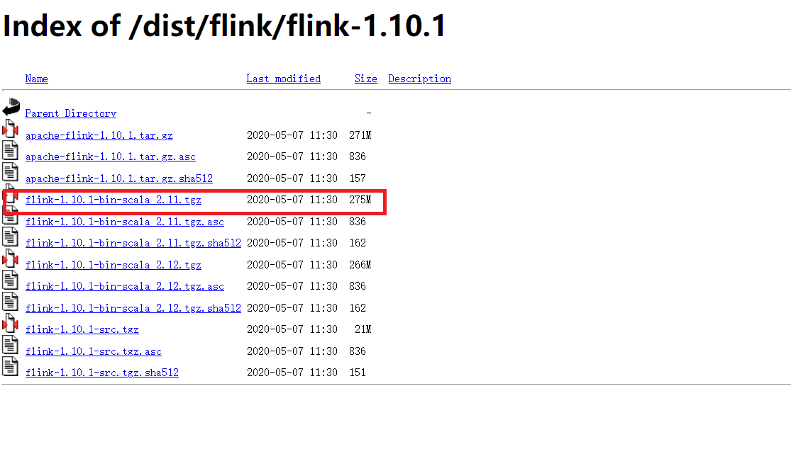
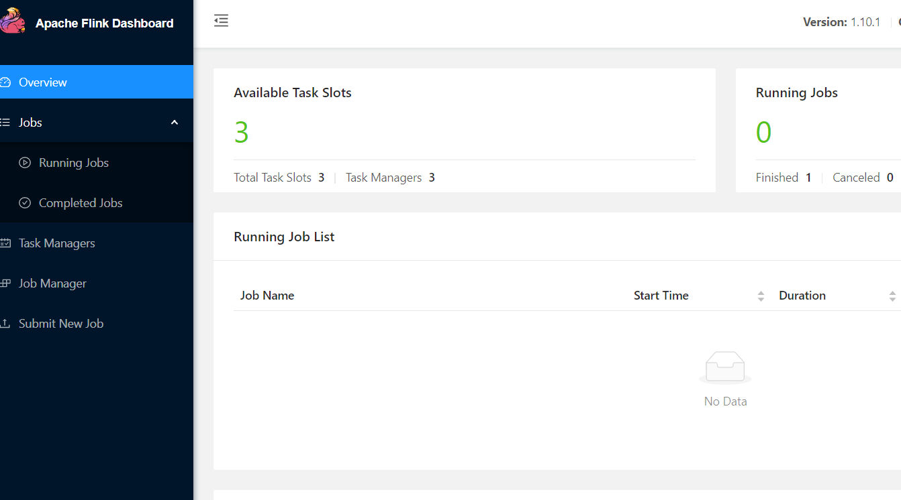
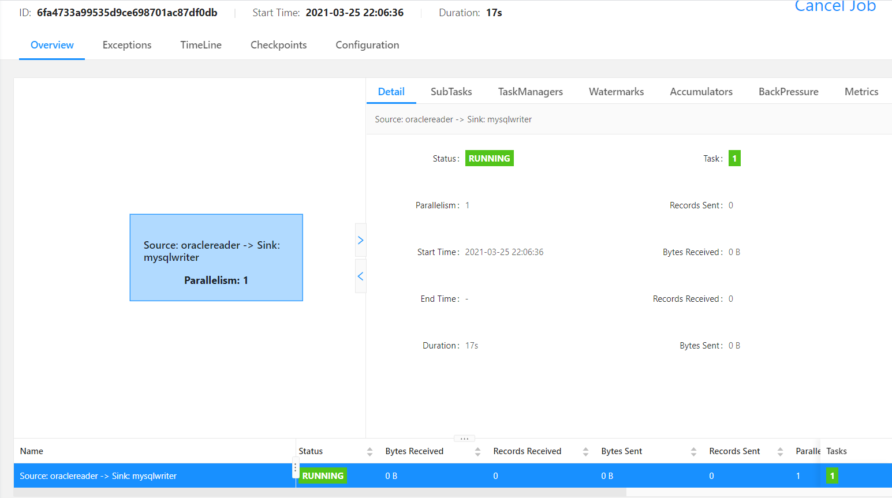
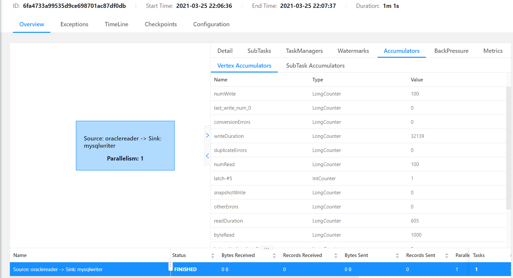

<!-- TOC -->

- [一、搭建环境](#一搭建环境)
    - [part1：clone flinkx代码到本地](#part1clone-flinkx代码到本地)
    - [part2：编译打包](#part2编译打包)
    - [part3：下载flink](#part3下载flink)
    - [part4：配置flink](#part4配置flink)
    - [part5:下载flink shade包](#part5下载flink-shade包)
    - [part6：拷贝](#part6拷贝)
- [二、运行任务](#二运行任务)
    - [part1：启动集群](#part1启动集群)
    - [part2：进入web页面，flinkx1:8081](#part2进入web页面flinkx18081)
    - [part3：运行任务](#part3运行任务)
    - [part4：关闭集群](#part4关闭集群)

<!-- /TOC -->

## 一、搭建环境


本地一台Windows电脑（git、maven、idea等装备齐全），三台服务器flinkx1、flinkx2、flinkx3（数量不限，一台也行）


首先确保所有机器都已安装java8或以上，配置好环境变量JAVA_HOME；服务器之间已开启ssh免密登陆，如果是一台服务器那就不需要了；hadoop集群环境也不是必选项


安装目标:


jobmanager：flinkx1             (负责任务的调度和资源管理，是集群的master节点)


taskmanager：flinkx1、flinkx2、flinkx3             (负责任务真正执行，是集群的worker节点)


### part1：clone flinkx代码到本地


```bash
git clone https://github.com/DTStack/flinkx.git
```


### part2：编译打包


```bash
mvn clean package -DskipTests
```


对于不需要的插件，可以修改$FLINKX_HOME目录下的pom文件，将不需要的模块和`flinkx-test`模块注释掉，在编译时将不会编译该插件，这样可以缩短编译时间.需要注意部分module之间存在依赖关系，根据Maven报错信息取消所需module的注释


### part3：下载flink


同样是在上述pom文件中，找到对应的flink版本，在flink官网下载flink，这里以1.10_release分支为例，对应的flink版本为1.10.1


<div align=center>
  
</div>

### part4：配置flink


将下载好的压缩包上传到flinkx1事先创建好的目录/data下，解压缩


```bash
tar -zxvf flink-1.10.1-bin-scala_2.11.tgz
```


进入flink的conf目录，编辑flink-conf.yaml文件


```yaml
#jobmanager RPC地址,修改为flinkx1的主机名或ip
jobmanager.rpc.address: flinkx1

#可以选择以下配置checkpoint来实现flinkx的断点续传功能，以使用hdfs为例，当然也可以选择其他的文件系统
#或者直接保存在本机的路径下，都是支持的，这里因为flinkx1、flinkx2、flinkx3上有hadoop集群，所以用hdfs
#flink状态后端用来区分状态的存储方式和存储位置，如果使用的是hdfs，选择filesystem
state.backend: filesystem
#状态后端的存储目录
state.backend.fs.checkpointdir: hdfs://ns/flinkx110/checkpoints/backend
#存储checkpoint的数据文件和元数据的目录
state.checkpoints.dir: hdfs://ns/flinkx110/checkpoints/metadata
#savepint的存储目录
state.savepoints.dir: hdfs://ns/flinkx110/savepoints
#checkpoint的默认保留数量
state.checkpoints.num-retained: 20

#还可以设置以下配置，为jobmanager、taskmanager分配内存大小
# The heap size for the JobManager JVM
jobmanager.heap.size: 1024m

# The total process memory size for the TaskManager.
taskmanager.memory.process.size: 2048m

#其他设置有需要再添加
```


还是conf目录，编辑masters文件，设置jobmanager的主机名或ip


```xml
flinkx1
```


编辑slaves文件，设置taskmanager 主机名或ip


```xml
flinkx1
flinkx2
flinkx3
```


### part5:下载flink shade包


[下载](https://mvnrepository.com/artifact/org.apache.flink/flink-shaded-hadoop-2-uber)对应Hadoop版本的flink shade包，放入$FLINK_HOME/lib目录下(从flink1.11开始官方不再提供打包好的flink shade包，需要自行[下载](https://github.com/apache/flink-shaded)打包)


### part6：拷贝


使用scp命令将flink目录拷贝到flinkx2、flinkx3相同路径下


```bash
scp -rp /data/flink-1.10.1 remote_username@flinkx2:/data
```


使用scp命令将Windows中编译的插件上传至flinkx1、flinkx2、flinkx3相同路径下,需要上传的目录有：$FLINKX_HOME/lib、以及$FLINKX_HOME/syncplugins或$FLINKX_HOME/plugins目录


```bash
scp -rp $FLINKX_HOME/bin remote_username@flinkx1:/data/flinkx

...
```


同理在flinkx1、flinkx2、flinkx3相同路径下放置任务脚本json文件，任务脚本的配置规则参考项目的介绍页面


```json
{
  "job": {
    "content": [
      {
        "reader": {
          "parameter": {
            "username": "username",	
            "password": "password",
            "connection": [{
              "jdbcUrl": ["jdbc:oracle:thin:@//127.0.0.1:1521/oracle"],
              "table": ["TABLES"]
            }],
            "column": ["ID","NAME"],
            "customSql": "",
            "where": "",
            "splitPk": "",
            "fetchSize": 1024,
            "queryTimeOut": 1000,
            "requestAccumulatorInterval": 2
          },
          "name": "oraclereader"
        },
        "writer": {
         "name": "mysqlwriter",
          "parameter": {
            "username": "username",
            "password": "password",
            "connection": [
              {
                "jdbcUrl": ["jdbc:mysql://127.0.0.1:3306/mysql?useUnicode=true&characterEncoding=utf8"],
                "table": ["students"]
              }
            ],
            "preSql": [],
            "postSql": [],
            "writeMode": "insert",
            "column": ["id","name"],
            "batchSize": 1024
          }
        }
      }
    ],
    "setting": {
      "speed": {
        "channel": 1,
        "bytes": 0
      },
      "errorLimit": {
        "record": 1
      },
      "restore": {
        "maxRowNumForCheckpoint": 0,
        "isRestore": false,
        "restoreColumnName": "",
        "restoreColumnIndex": 0
      },
      "log" : {
        "isLogger": false,
        "level" : "debug",
        "path" : "",
        "pattern":""
      }
    }
  }
}


```


ps：由于Windows和Linux文件格式的差异，执行$FLINKX_HOME/bin/flinkx启动脚本时会报找不到文件，需将此文件设置filefomat=unix


到此，环境搭建工作完成


## 二、运行任务


### part1：启动集群


进入flink的bin目录运行start-cluster.sh


### part2：进入web页面，flinkx1:8081


可以看到集群信息：


<div align=center>
  
</div>


### part3：运行任务


进入flinkx目录，运行命令：


```json
bin/flinkx -mode standalone \
           -job /data/flinkx/jobs/oraclereader_mysqlwriter.json \
           -pluginRoot /data/flinkx/syncplugins \
           -flinkconf /data/flink-1.10.1/conf \
           -confProp "{\"flink.checkpoint.interval\":60000}"
```


<div align=center>
  
</div>


任务运行成功，数据成功写入mysql：


<div align=center>
  
</div>


### part4：关闭集群


进入flink的bin目录运行stop-cluster.sh
