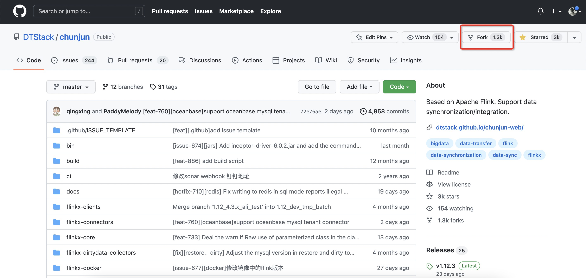
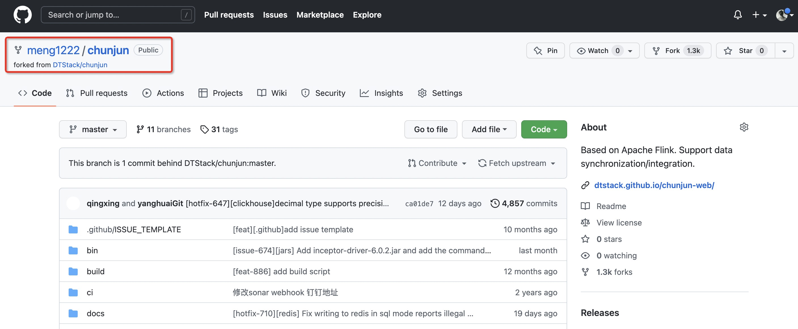
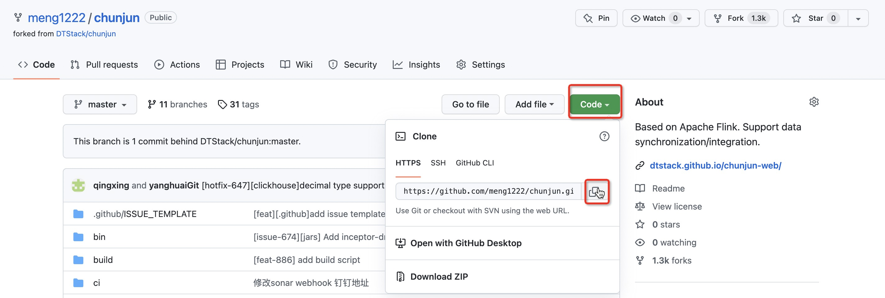
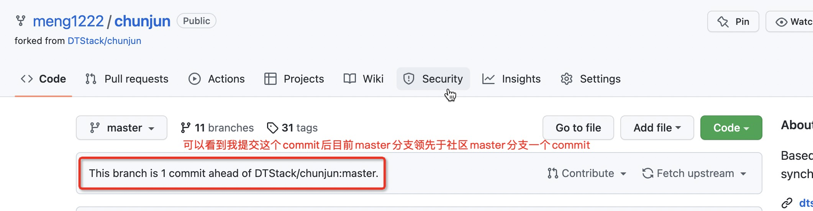
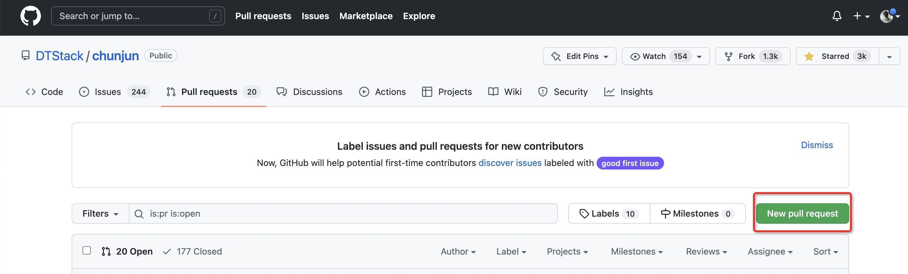
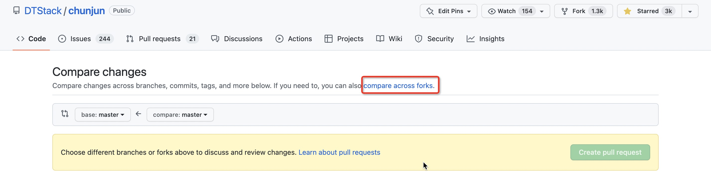
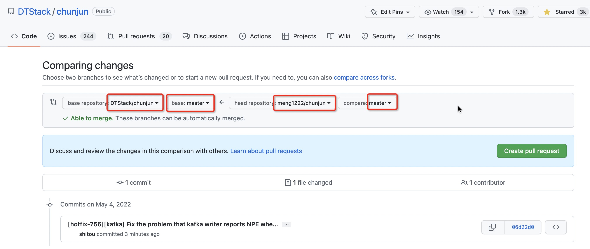
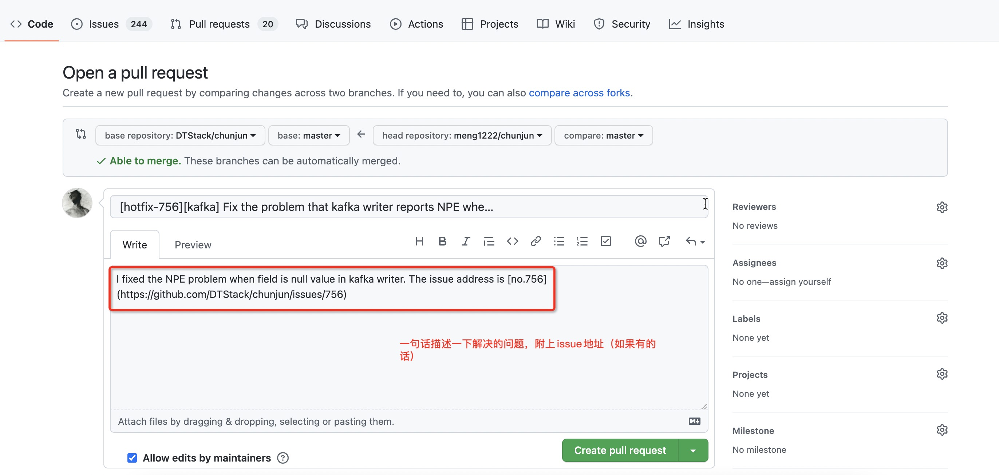
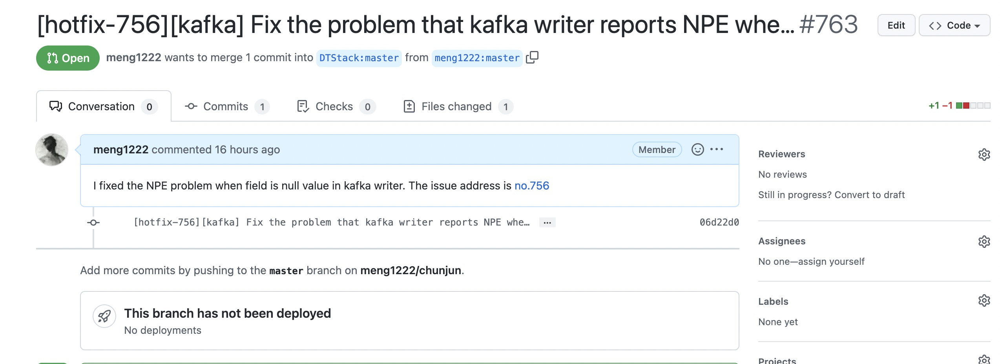

# 如何提交一个优秀的pr
在github上提交pr是参与ChunJun开源项目的一个重要途径，小伙伴们在使用中的一些功能上feature或者bug都可以向社区提交pr贡献代码，也可以根据已有的issue提供自己的解决方案。下面给大家带来提交一个优秀PR的步骤。

## 第一步：fork chunjun到自己的github仓库


点击fork后就可以在自己仓库中看到以你名字命名的chunjun项目了：



## 第二步：clone chunjun到本地IDE


## 第三步：将DTStack/chunjun设置为本地仓库的远程分支upstream
```shell
$ cd chunjun
# add upstream
$ git remote add upstream https://github.com/DTStack/chunjun.git
# 查看远程仓库设置
$ git remote -v
origin  https://github.com/your_name/chunjun.git (fetch)
origin  https://github.com/your_name/chunjun.git (push)
upstream    https://github.com/DTStack/chunjun.git (fetch)
upstream    https://github.com/DTStack/chunjun.git (push)
```
## 第四步：提交代码
任何一个提交都要基于最新的分支
**切换分支**
```shell
# Fetch branches from upstream.
$ git remote update upstream -p
# Checkout a new branch.
$ git checkout -b branch_name
# Pull latest code into your own branch.
$ git pull upstream master:branch_name
```
**本地修改代码后，提交commit**
- commit message 规范：
  [commit_type-#issue-id] [module] message
- commit_type:
    - feat：表示是一个新功能（feature)
    - hotfix：hotfix，修补bug
    - docs：改动、增加文档
    - opt：修改代码风格及opt imports这些，不改动原有执行的代码
    - test：增加测试
- eg:[hotfix-#12345][mysql] Fix mysql time type loses precision.

注意：
（1）commit 需遵循规范，给维护者减少维护成本及工作量，对于不符合规范的commit，我们不与合并；
（2）对于解决同一个Issue的PR，只能存在一个commit message，如果出现多次提交的message，我们希望你能将commit message 'squash' 成一个；
（3）message 尽量保持清晰简洁，但是也千万不要因为过度追求简洁导致描述不清楚，如果有必要，我们也不介意message过长，前提是，能够把解决方案、修复内容描述清楚；

```shell
# 提交commit前先进行代码格式化
$ mvn spotless:apply
$ git commit -a -m "<you_commit_message>"
```
**rebase远程分支**

这一步很重要，因为我们仓库中的chunjun代码很有可能已经落后于社区，所以在 push commit前需要rebase，保证当前commit是基于社区最新的代码，很多小伙伴没有这一步导致提交的pr当中包含了其他人的commit
```shell
$ git fetch upstream
$ git rebase upstream/branch_name
```

*rebase后有可能出现代码冲突，一般是由于多人编辑同一个文件引起的，只需要根据提示打开冲突文件对冲突部分进行修改，将提示的冲突文件的冲突都解决后，执行
```shell
$ git add .
$ git rebase --continue
```
依此往复，直至屏幕出现类似rebase successful字样即可

*rebase之后代码可能无法正常推送，需要```git push -f``` 强制推送，强制推送是一个有风险的操作，操作前请仔细检查以避免出现无关代码被强制覆盖的问题

**push到github仓库**
```shell
$ git push origin branch_name
```
## 第五步：提交pr
以笔者修复kafka写入过程中出现空指针问题为例，经过步骤四笔者已经把代码提交至笔者自己仓库的master分支



进入chunjun仓库页面，点击Pull Request





选择head仓库和base仓库以及相应的分支



填写pr信息，pr信息应该尽量概括清楚问题的前因后果，如果存在对应issue要附加issue地址，保证问题是可追溯的





PR提交成功后需要一段时间代码review，可以耐心等待一下项目维护者review后合入，或者在PR评论区艾特相关人员。
