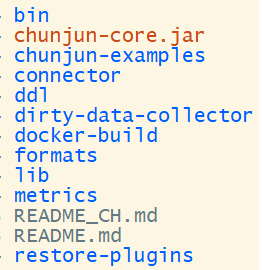
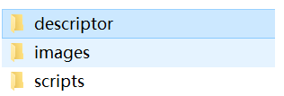

## 如何构建chunjun的CDH-parcel包

本文面向ChunJun的CDH环境的应用开发人员，尝试通过一个Cloudera CDH环境应用开发者的角度阐述如何构建chunjun CDH parcel，并且集成到CDH中。
主要步骤如下：

1. 前提环境准备
2. cm_ext_tools编译和部署
3. 构造parcel包
4. 构造csd
5. 集成到CDH

### 一. 前提环境准备

#### （1）CDH集群

首先您需要一个已经搭建成功的CDH集群，因为chunjun需要依赖flink，所以首先需要成功集成flink，而flink又依赖hdoop，所以您需要确认如下信息：

1. CDH 版本
2. hadoop版本
3. flink版本

然后，根据flink版本来选择使用对应版本的chunjun进行parcel包的构建工作。

本文使用了CDH6.3.2，Flink-1.12.7 Hadoop3.0.0 的CDH前提环境来集成CHUNJUN， 因此本文使用的chunjun版本兼容flink1.12.7。
写此文时，master分支就是当时最新的支持flink1.12.7的纯钧版本。

关于CDH部署和Flink集成到CDH，不是本文阐述范围, 本文不再阐述，请各位同学搜寻其他资料完成。

#### （2）chunjun部署包

部署包可自己本地开发环境编译打包得到，也可以使用您已经部署的包。
如果想自己编译打包，请参考 README_CH.md 的 源码编译 章节。

本文使用的包采用编译打包生成的 assemly 包解压而来，包名为chunjun，包内的结构如下：



### 二. cm_ext_tools编译和部署

#### (1) 从github上下载源码

地址： https://github.com/cloudera/cm_ext

#### (2) 编译打包

此步骤主要是为了生成  XXX/cm_ext/validator/target/validator.jar 文件。
同学们遵循 cm_ext 工程的 README.md 文件操作即可完成。

validator.jar 文件将被用于后面制作csd jar包。


### 三. 构造parcel包

#### (1) 规划与准备
首先需要一台机器来制作parcel包，这里我选择的是一台linux机器。
* 创建一个工作目录，比如 chunjunparcel，
* 将 validator.jar 上传到 该目录。

#### (2) 制作parcel包的源文件

这一步你可以在linux上执行，也可以在你的本地开发机（一般为windows环境）上执行。
我这里就在开发机windows上执行了。

#####1. 创建一个文件夹，命名为 CHUNJUN-#chunjun_varsion-flink#flink_version, 比如：
```shell
mkdir CHUNJUN-1.12-flink.1.12.7
```

#####2. 在这个文件里创建2个子文件夹， 分别命名为 lib 和 meta

#####3. 将chunjun的部署包解压到 lib 目录

#####4. 创建 chunjun_env.sh 文件， 此文件位于 meta 目录内， 文件内容如下：

```shell
#!/bin/bash
############################################################################
#
# Licensed to the Apache Software Foundation (ASF) under one
# or more contributor license agreements.  See the NOTICE file
# distributed with this work for additional information
# regarding copyright ownership.  The ASF licenses this file
# to you under the Apache License, Version 2.0 (the
# "License"); you may not use this file except in compliance
# with the License.  You may obtain a copy of the License at
#
# http://www.apache.org/licenses/LICENSE-2.0
#
# Unless required by applicable law or agreed to in writing, software
# distributed under the License is distributed on an "AS IS" BASIS,
# WITHOUT WARRANTIES OR CONDITIONS OF ANY KIND, either express or implied.
# See the License for the specific language governing permissions and
# limitations under the License.
#
############################################################################

set -ex

#The following is written to aid local testing
if [ -z ${PARCELS_ROOT} ] ; then
    export MYDIR=`dirname "${BASH_SOURCE[0]}"`
    PARCELS_ROOT=`cd ${MYDIR}/../.. &&  pwd`
fi

export CHUNJUN_HOME=${PARCELS_ROOT}/${PARCEL_DIRNAME}/lib/chunjun

[ -d ${CHUNJUN_HOME} ] || {
    echo "Could not find chunjun parcel lib dir, exiting" >&2
    exit 1
}

echo "Set CHUNJUN_HOME to '${CHUNJUN_HOME}'"
echo "chunjun_env.sh successfully executed at `date`"


```

#####5. 创建 parcel.json 文件， 此文件位于 meta 目录内, 文件内容如下:
```shell
{
    "schema_version": 1,
    "name": "CHUNJUN",
    "version": "1.12-flink.1.12.7",
     "setActiveSymlink":   true,
    "packages": [
        {
            "version": "1.12+flink.1.12.7",
            "name": "chunjun"
        }
    ],
    "components": [
        {
            "name": "chunjun",
            "version": "1.12-flink.1.12.7",
            "pkg_version": "1.12+flink.1.12.7",
            "pkg_release": "flink.1.12.7"
        }
    ],
    "scripts": {
        "defines": "chunjun_env.sh"
    },
    "depends": "CDH (>= 6.2)",
    "provides": [
        "chunjun"
    ],
    "users": {
        "chunjun" : {
            "home" : "/data/lib/chunjun",
            "shell" : "/sbin/nologin",
            "extra_groups" : [],
            "longname" : "Chunjun"
        }
    },
    "groups": ["flink"]
}
```

注意：

* 如果 您使用的CDH 版本不是大于等于6.2 ，请修改 "depends": "CDH (>= 6.2)",
chunjun和flink版本也需要一起修改。
* users-chunjun-home 配置项为chunjun用户的家目录

#### (2) 使用 parcel包源文件生成 parcel 包

将 CHUNJUN-1.12-flink.1.12.7 源文件上传到 linux 工作目录， 然后 执行如下命令生成parcel包：
```shell

tar -zcvf CHUNJUN-1.12-flink.1.12.7-el7.parcel CHUNJUN-1.12-flink.1.12.7
```
注意：
* parcel包名后面一定要有 ”-el7.parcel“ ，如果你是 linux6的系统，请改为el6

生成好 parcel 包后，执行命令进行验证, 结构为 validate success 即可：
```shell script
 java -jar ./validator.jar -f  ./CHUNJUN-1.12-flink.1.12.7-el7.parcel
```

如果有失败的情况，则说明parcel 包名或者内部的meta文件有问题，需要针对问题修改了。

制作 sha 文件，执行如下命令：
```shell script
sha1sum CHUNJUN-1.12-flink.1.12.7-el7.parcel
```

将 sha 值 写入 parcel 的 sha 文件， 比如：
```shell script
echo e19557d9cef57d19c6dfbbe0aa05b01aa8c6ca52 > CHUNJUN-1.12-flink.1.12.7-el7.parcel.sha
```

至此，恭喜您，您已经完成一半工作了。 下面将开始制作csd文件。

### 四. 构造csd 

#### (1) 规划目录

创建csd-src文件夹，在文件夹内新建三个子文件夹，分别为 descriptor， images， scritps。


#### (2) 构造csd源文件
##### 1. 在 descriptor文件夹内创建 service.sdl 文件， 内容如下：
```shell script
{
	"name": "CHUNJUN",
	"label": "Chunjun",
	"description": "纯钧（ChunJun，原名FlinkX），是一款稳定、易用、高效、批流一体的数据集成框架，目前基于实时计算引擎Flink实现多种异构数据源之间的数据同步与计算，已在上千家公司部署且稳定运行。",
	"version": "1.12",
	"runAs": {
		"user": "flink",
		"group": "supergroup"
	},
	"icon": "images/chunjun.png",
	"compatibility": {
		"generation": 1,
		"cdhVersion": {
			"min": 5,
			"max": 6
		}
	},
	"serviceDependencies": [
		{
		"name": "YARN",
		"required": "true"
		}
	],
	"parameters" : [
		{
			"name" : "hadoop_home",
			"label" : "Hadoop Home Path",
			"description" : "Hadoop 的安装家目录",
			"configName" : "hadoop_home",
			"required" : "true",
			"type" : "string",
			"default" : "/opt/cloudera/parcels/CDH/lib/hadoop"
		},
		{
			"name" : "flink_home",
			"label" : "Flink Home Path",
			"description" : "Flink的安装家目录",
			"required" : "true",
			"type" : "string",
			"default" : "/opt/cloudera/parcels/FLINK/lib/flink"
		}
	],
	"gateway" : {
		"alternatives" : {
		  "name" : "chunjun-conf",
		  "priority" : 51,
		  "linkRoot" : "/etc/chunjun"
		},
		
		"scriptRunner" : {
		  "program" : "scripts/control.sh",
		  "args" : [],
		  "environmentVariables" : {
			"HADOOP_HOME" : "${hadoop_home}",
			"FLINK_HOME" : "${flink_home}"
		  },
		  "referencedEnvironmentVariables" : {
			"CM_VERSION" : "${cm_version}"
		  }
		},
		"configWriter" : {
		  "generators" : [
			{
			  "filename" : "chunjun-conf/chunjun-defaults.conf",
			  "configFormat" : "properties",
			  "includedParams" : [
				
			  ],
			  "additionalConfigs" : [
				{
				  "key" : "test",
				  "value" : "1"
				}
			  ]
			}
		  ],
		  "auxConfigGenerators" : [
			
		  ],
		  "peerConfigGenerators" : [
			
		  ]
		}
	}

}
```

注意：
* "version": "1.12" 为 chunjun 的版本
* 一般情况下，其他内容均无需修改

##### 2. 在 images 文件夹内创建 chunjun.png 图片
这个就是一个 16*16 像素的chunjun logo图片。
您可以直接使用如下图片素材即可：
```shell script
chunjun/website/src/images/doc/contribute/chunjun.png 
```

##### 3. 在 scripts 文件夹内创建 control.sh 文件， 内容如下：
```shell script
#!/bin/bash
##
# Licensed to Cloudera, Inc. under one
# or more contributor license agreements.  See the NOTICE file
# distributed with this work for additional information
# regarding copyright ownership.  Cloudera, Inc. licenses this file
# to you under the Apache License, Version 2.0 (the
# "License"); you may not use this file except in compliance
# with the License.  You may obtain a copy of the License at
#
#     http://www.apache.org/licenses/LICENSE-2.0
#
# Unless required by applicable law or agreed to in writing, software
# distributed under the License is distributed on an "AS IS" BASIS,
# WITHOUT WARRANTIES OR CONDITIONS OF ANY KIND, either express or implied.
# See the License for the specific language governing permissions and
# limitations under the License.
##

#
# Set of utility functions shared across different Spark CSDs.
#

set -ex

#1. set env var
function prepare_chunjun_env {
	if [ ! -f "/etc/profile.d/chunjun_env.sh" ]; then
		touch /etc/profile.d/chunjun_env.sh
	fi
	chmod 644 /etc/profile.d/chunjun_env.sh

	echo "export FLINK_HOME=${FLINK_HOME}
export CHUNJUN_HOME=/opt/cloudera/parcels/CHUNJUN/lib/chunjun
export HADOOP_HOME=${HADOOP_HOME}" > /etc/profile.d/chunjun_env.sh

	export FLINK_HOME=${FLINK_HOME}
	export CHUNJUN_HOME=/opt/cloudera/parcels/CHUNJUN/lib/chunjun-dist
	export HADOOP_HOME=${HADOOP_HOME}
}

prepare_chunjun_env 

#2. dos2unix scripts
if [ ! -d "$CHUNJUN_HOME/bin" ]; then
    echo "err: CHUNJUN_HOME does not exist."
	exit -1;
fi
dos2unix $CHUNJUN_HOME/bin/*

```

这一步只是增加了一些home环境变量，HADOOP_HOME 和 FLINK_HOME 后面是可以通过CDH管理台进行修改的。

至此，csd 源文件构建完成。

### (4) 利用 csd 源文件生成 csd 文件

将 csd 源文件上传到 linux 工作目录下。
进行验证：
```shell script
cd csd-src
java -jar ../validator.jar -s descriptor/service.sdl
```
如果有问题，则serivice.sdl 文件有语法问题，不符合规范。
如果成功，则在 csd-src 文件夹内执行如下指令，打包生成 csd 文件：
```shell script
jar -cvf CHUNJUN-1.12.jar *
```
至此，csd jar 文件生成完成，恭喜您， 您目前已经成功生成了 CHUNJUN parcel 包了。下一步您可以集成入CDH了。
* 最终生成的为如下 3 个包：
```shell script
CHUNJUN-1.12-flink.1.12.7-el7.parcel
CHUNJUN-1.12-flink.1.12.7-el7.parcel.sha
CHUNJUN-1.12.jar
```

### 五. 集成到CDH
这一步就是CDH扩展集成第三方PARCEL。

1. 将 CHUNJUN-1.12-flink.1.12.7-el7.parcel 和 CHUNJUN-1.12-flink.1.12.7-el7.parcel.sha 包放入 CDH 管理主节点的parcel-repo目录，
或者您也可以将他们放入您自己的http服务目录，这个根据您环境的情况决定就好了。
比如， 我的就是放入 repo 目录：
```shell script
/opt/cloudera/parcel-repo/
```

2. 将 CHUNJUN-1.12.jar 放入 CDH 管理节点的 csd 目录, 比如：
```shell script
/opt/cloudera/csd/
```

3. 登录CDH CM web 管理台 的 parcel 界面， 依次执行 parcel 检测， 分配，激活。

4. 重启 cloudera-scm-server 服务
这一步主要是为了让 添加服务的时候展现出chunjun 服务选项。

5. 重新登录 CDH CM web 管理台， 添加chunjun服务。过程中，会需要分配角色gateway，即chunjun部署的客户端，
同学们根据您的需要选择即可， 点击继续则开始安装和部署chunjun了。

至此，如果一切顺利，您就已成功将chunjun集成到了CDH中。 
