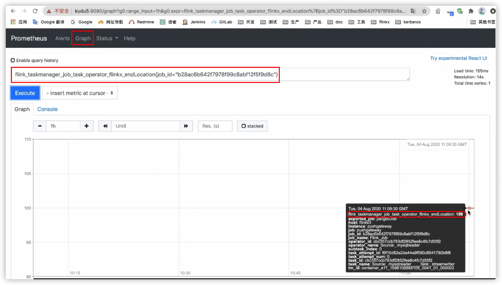

# 什么是增量同步

​	增量同步主要针对某些只有Insert操作的表，随着业务增长，表内数据越来越多。如果每次都同步整表的话，消耗的时间和资源会比较多。因此需要一个增量同步的功能，每次只读取增加部分的数据。

## 原理解析

​	其实现原理实际上就是配合增量键在查询的sql语句中拼接过滤条件，比如 where id > ? ，将之前已经读取过的数据过滤出去。

​	增量同步是针对于两个及以上的同步作业来说的。对于初次执行增量同步的作业而言，实际上是整表同步，不同于其他作业的在于增量同步作业会在作业执行完成后记录一个endLocation指标，并将这个指标上传到prometheus以供后续使用。除第一次作业外，后续的所有增量同步作业都会取上一次作业的endLocation做为本次作业的过滤依据（startLocation）。比如第一次作业执行完后，endLocation为10，那么下一个作业就会构建出例如 SELECT id,name,age from table where id > 10的SQL语句，达到增量读取的目的。

> 增量键：数据库表中增量递增的字段，比如自增id

## 使用限制

- 只有RDB的Reader插件插件可以使用
    - 通过构建SQL过滤语句实现，因此只能用于RDB插件
    - 增量同步只关心读，不关心写，因此只与reader插件有关
- 增量字段只能为数值类型和时间类型
    - 指标需要上传到prometheus，而prometheus不支持字符串类型，因此只支持数据类型和时间类型。时间类型会转换成时间戳后上传
- 增量键的值可以重复，但必须递增
    - 由于使用'>'的缘故，要求字段必须递增。

## 如何处理增量键重复场景

​	考虑可能存在这样的场景：某一次增量同步后的endLocation为x，在下一次增量同步作业启动的间隙中，表内又写入了增量键的值=x的数据。按照默认的情况，假设增量键为id，下一次作业会拼接例如SELECT id,name,age FROM table WHERE id > x。此时在间隙中插入的id=x的数据将会丢失。

​	为了对应上述场景，chunjun增量同步提供了配置项useMaxFunc（默认值为false）。在设置useMaxFunc=true时，chunjun会在增量作业启动时获取当前数据库中增量键的最大值作为本次作业的endLocation，并且将用于startLocation的运算符号从'>'改为'>='。例如：

- 某一次增量启动时上次作业的endLocation为10，id最大值为100，那么将会拼接SQL语句 SELECT id,name,age FROM table WHERE id >= 10 AND id < 100
- 下一次增量作业启动时id的最大值为200，那么将会拼接SQL语句 SELECT id,name,age FROM table WHERE id >=100 AND id < 200


# 如何使用增量同步

## 环境准备

- 由于是使用prometheus收集相关指标信息，因此需要先安装prometheus和pushgateway。

- 下载Flink Metric Prometheus依赖，将其放入Flink lib目录下

    - https://repo1.maven.org/maven2/org/apache/flink/flink-metrics-prometheus_2.12/1.12.7/flink-metrics-prometheus_2.12-1.12.7.jar

- 修改Flink配置文件，conf/flink-conf.yaml，新增flink metric相关配置

  ```yaml
  metrics.reporter.promgateway.host: host01
  metrics.reporter.promgateway.port: 9091
  metrics.reporter.promgateway.deleteOnShutdown: false
  metrics.reporter.promgateway.class: org.apache.flink.metrics.prometheus.PrometheusPushGatewayReporter
  ```

## 脚本配置

主要的配置项就是increColumn和startLocation

以mysql为例脚本如下：

```json
{
  "job": {
    "content": [
      {
        "reader": {
          "name": "mysqlreader",
          "parameter": {
            "column": [
              {
                "name": "id",
                "type": "int"
              },
              {
                "name": "name",
                "type": "string"
              },
              {
                "name": "age",
                "type": "int"
              }
            ],
            "customSql": "",
            "increColumn": "id",  //指定增量字段进行增量同步，增量字段必须是column存在的字段
            "startLocation": "2", //第一次执行时为空，可配置字符串或不配置，后续提交的作业使用prometheus中指标值
            "username": "root",
            "password": "root",
            "connection": [
              {
                "jdbcUrl": [
                  "jdbc:mysql://localhost:3306/test?useSSL=false"
                ],
                "table": [
                  "baserow"
                ]
              }
            ]
          }
        },
        "writer": {
          "name": "streamwriter",
          "parameter": {
            "print": false
          }
        }
      }
    ],
    "setting": {
      "restore": {
        "restoreColumnName": "id"
      },
      "speed": {
        "channel": 1,
        "bytes": 0
      }
    }
  }
}

```


## 查询prometheus

使用flink作业对应的JobId在普罗米修斯中查询endLocation指标值

```
flink_taskmanager_job_task_operator_chunjun_endlocation{job_id="xxx"}
```


