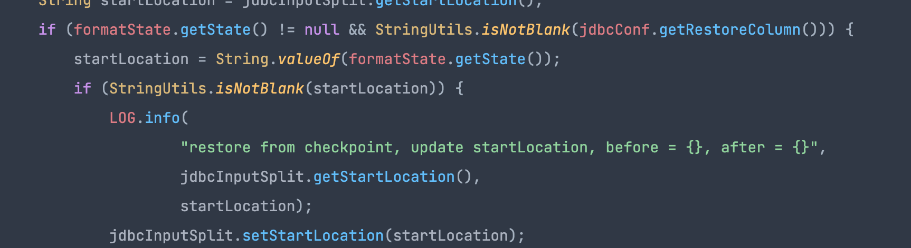
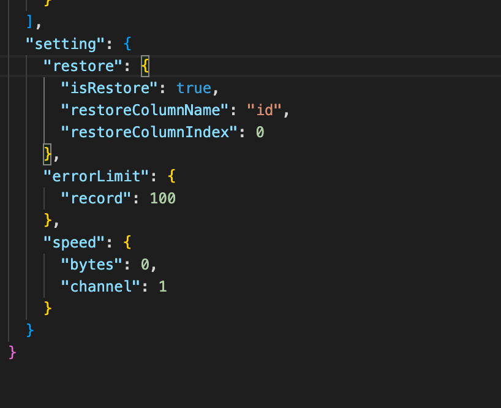

# 断点续传介绍
断点续传是为了在离线同步的时候，针对长时间同步任务如超过1天，如果在同步过程中由于某些原因导致任务失败，从头再来的话成本非常大，因此需要一个断点续传的功能从任务失败的地方继续。
## 原理

- 基于flink的checkpoint，在checkpoint的时候 会存储source端最后一条数据的某个字段值，sink端插件执行事务提交。
- 在任务失败，后续通过checkpoint重新运行时，source端在生成select语句的时候将state里的值作为条件拼接进行数据的过滤，达到从上次失败位点进行恢复

jdbcInputFormat在拼接读取sql时，如果从checkpoint恢复的state不为空且restoreColumn不为空，则此时会将checkpoint里的state作为起点开始读取数据
# 适用场景
通过上述原理我们可知道 source端必须是RDB类型插件，因为是通过select语句拼接where条件进行数据过滤达到断点续传的，同时断点续传需要指定一个字段作为过滤条件，且此字段要求是递增的

- 任务需要开启checkpoint
- reader为RDB的插件均支持且writer支持事务的插件(如 rdb  filesystem等)，如果下游是幂等性则writer插件也不需要支持事务
- 作为断点续传的字段在源表里的数据是递增的，因为过滤条件是 >
## 参数配置
开启restore需要在脚本的restore里配置相关参数

| 参数 | 含义 | 类型 |
| --- | --- | --- |
| isResore | 是否开启断点续传，true代表开启断点续传，默认不开启 | boolean |
| restoreColumnName | 断点续传字段 | string |
| restoreColumnIndex | 断点续传字段在reader里的column的位置 | int |

### 示例

